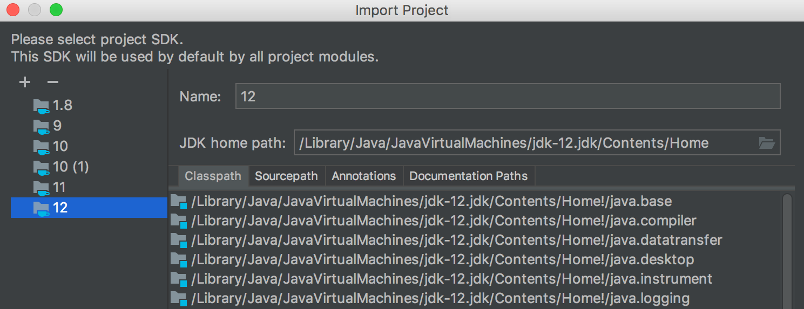
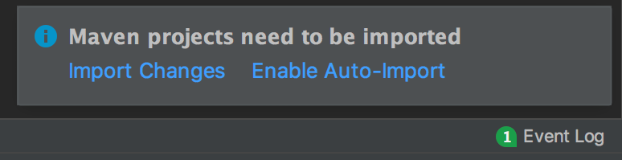

Getting Started with Java
============================

This chapter is about how to start learning Java 12 and Java in general.
We will begin with the basics, first explaining what Java is and its
main terms, followed by how to install the necessary tools to write and
run (execute) a program. In this respect, Java 12 is not much different
to the previous Java versions, so this chapter's content is applies to
the older versions too.

We will describe and demonstrate all the necessary steps for building
and configuring a Java programming environment. This is the bare minimum
that you have to have on the computer in order to start programming. We
also describe the basic Java language constructs and illustrate them
with examples that can be executed immediately.

The best way to learn a programming language, or any language for that
matter, is to use it, and this chapter guides the reader on how they can
do this with Java. The topics covered in this chapter include the
following:

-   How to install and run Java
-   How to install and run an **Integrated Development Environment**
    (**IDE**)
-   Java primitive types and operators
-   String types and literals
-   Identifiers and variables
-   Java statements

#### Pre-reqs:
- Google Chrome (Recommended)

#### Lab Environment
There is no requirement for any setup.

**Note:** Terminal(s) are already running. You can also open new terminal by clicking:
`File` > `New` > `Terminal`.

All labs are present in `work/learn-java-12-programming` folder. To copy and paste: use **Control-C** and to paste inside of a terminal, use **Control-V**

<h2><span style="color:red;">Instructions:</span></h2>

- Quiz and its answers can be found in the files which are already opened in jupyertLab editor.
- We will be using `mvn` to compile source code and `java` cli to run java code in the lab.
- Intructions below also contain instructions how to use IntelliJ IDEA for local development.
- Make sure to run `cd ~/work/learn-java-12-programming/exercises` command in the terminal(s)before compiling and running code. 
- Run following command to compile and package java project everytime after making change in java source:  `mvn clean package` . You can also run following commands first to clear any changes you made in java project and sync with remote.

`cd ~/work/learn-java-12-programming && git stash && git pull`


How to install and run Java
============================

When somebody says "*Java*," they may mean quite different things:

-   **Java programming language**: A high-level programming language
    that allows an intent (a program) to be expressed in a
    human-readable format that can be translated in the binary code
    executable by a computer
-   **Java compiler**: A program that can read a text written in the
    Java programming language and translate it into a bytecode that can
    be interpreted by **Java Virtual Machine** (**JVM**) in the binary
    code executable by a computer
-   **Java Virtual Machine** (**JVM**): A program that reads a compiled
    Java program and interprets it into the binary code that is
    executable by a computer
-   **Java Development Kit** (**JDK**): The collection of programs
    (tools and utilities), including Java compiler, JVM, and supporting
    libraries, which allow the compilation and execution of a program
    written in the Java language

The following section walks the reader through the installation of the
JDK of Java 12 and the basic related terms and commands. 

What is JDK and why do we need it?
----------------------------------

As we have mentioned already, JDK includes a Java compiler and JVM. The
task of the compiler is to read a .java file that contains the text of
the program written in Java (called **source code**) and transform
(compile) it into a bytecode stored in a .class file. The JVM can
then read the .class file, interpret the bytecode in a binary code, and
send it to the operating system for execution. Both the compiler and JVM
have to be invoked explicitly from the command line. 

To support the .java file compilation and its bytecode execution, JDK
installation also includes standard Java libraries called **Java Class
Library** (**JCL**). If the program uses a third-party library, it has
to be present during compilation and execution. It has to be referred
from the same command line that invokes the compiler and later when the
bytecode is executed by JVM. JCL, on the other hand, does not need to be
referred to explicitly. It is assumed that the standard Java libraries
reside in the default location of the JDK installation, so the compiler
and JVM know where to find them. 

If you do not need to compile a Java program and would like to run only
the already compiled .class files, you can download and install **Java
Runtime Environment** (**JRE**). For example, it consists of a subset of
the JDK and does not include a compiler.

Sometimes, JDK is referred to as a **Software Development Kit**
(**SDK**), which is a general name for a collection of software tools
and supporting libraries that allow the creation of an executable
version of a source code written using a certain programming language.
So, JDK is an SDK for Java. This means it is possible to call JDK an
SDK.

You may also hear the terms *Java platform* and *Java edition* in
relation to a JDK. A typical platform is an operating system that allows
a software program to be developed and executed. Since JDK provides its
own operating environment, it is called a platform too. An **edition**
is a variation of a Java platform (JDK) assembled for a specific
purpose. There are five Java platform editions, as listed here:

-   **Java Platform Standard Edition** (**Java SE**): This includes JVM,
    JCL, and other tools and utilities.
-   **Java Platform Enterprise Edition** (**Java EE**): This includes
    Java SE, servers (computer programs that provide services to the
    applications), JCL, other libraries, code samples, and tutorials,
    and other documentation for developing and deploying large-scale,
    multi-tiered, and secure network applications.
-   **Java Platform Micro Edition** (**Java ME**): This is a subset of
    Java SE with some specialized libraries for developing and deploying
    Java applications for embedded and mobile devices, such as phones,
    personal digital assistants, TV set-top boxes, printers, and
    sensors. A variation of Java ME (with its own JVM implementation) is
    called **Android SDK**. It was developed by Google for Android
    programming.
-   **Java Card**: This is the smallest of the Java editions and is
    intended for developing and deploying Java applications onto small
    embedded devices such as smart cards. It has two editions: **Java
    Card Classic Edition**, for smart cards, based on ISO7816 and
    ISO14443 communication, and **Java Card Connected Edition**, which
    supports a web application model and TCP/IP as basic protocol and
    runs on high-end secure microcontrollers.

So, to install Java means to install JDK, which also means to install
Java platform on one of the listed editions. In this book, we are going
to talk about and use only Java SE.

<h2><span style="color:red;">Note:</span></h2>

<span style="color:red;">- Java has been installed already in the lab environment</span><br>
<span style="color:red;">- Intructions below also contain information how to setup IDE locally. You can skip these steps and click <a href="#start">go to exercise</a> to start running java code.</span>

Installing Java SE
------------------

All the recently released JDKs are listed on the official Oracle
page: [www.oracle.com/technetwork/java/javase/overview/index.html](https://www.oracle.com/technetwork/java/javase/overview/index.html) (we
will call it an **Installation Home Page** for the further references).

Here are the steps that need to be followed to install Java SE:

1.  Find the link to the Java SE version you are looking for (Java SE 12
    in this case) and click on it.
2.  You will be presented with the various links, one of which is
    Installation Instructions. Alternatively, you could get to this page
    by clicking the Downloads tab.
3.  Click the DOWNLOAD link under the title Oracle JDK.
4.  A new screen will give you the option to accept or decline a License
    Agreement using a radio button and a list of links to various JDK
    installers.
5.  Read the License Agreement and make your decision. If you do not
    accept it, you cannot download the JDK. If you accept the License
    Agreement, you can select the JDK installer from the available list.
6.  You need to choose the installer that fits your operating system and
    the format (extension) you are familiar with.
7.  If in doubt, go back to the Installation Home Page, select the
    Downloads tab, and click the **Installation Instructions** link.
8.  Follow the steps that correspond to your operating system.
9.  The JDK is installed successfully when the java -version command on
    your computer displays the correct Java version, as demonstrated in
    the following screenshot, for example:


Commands, tools, and utilities
------------------------------

If you follow the installation instructions, you may have noticed a link
(Installed Directory Structure of JDK) given under the Table of
Contents. It brings you to a page that describes the location of the
installed JDK on your computer and the content of each directory of the
JDK root directory. The bin directory contains all the executables that
constitute the Java commands, tools, and utilities. If the directory bin
is not added to the PATH environment variable automatically, consider
doing it manually so that you can launch a Java executable from any
directory.

In the previous section, we have already demonstrated the Java
command, java -version. A list of the other Java executables
available (commands, tools, and utilities) can be found in the Java SE
documentation ([https://www.oracle.com/technetwork/java/javase/documentation/index.html](https://www.oracle.com/technetwork/java/javase/documentation/index.html))
by clicking the Java Platform Standard Edition Technical Documentation
site link, and then the Tools Reference link on the next page. You can
learn more about each executable tool by clicking its link.

You can also run each of the listed executables on your computer using
one of the following options: -?, -h, --help, or -help. It will display
a brief description of the executable and all its options.

The most important Java commands are the following:

-   javac: This reads a .java file, compiles it, and creates one or
    more corresponding .class files, depending on how many Java classes
    are defined in the .java file.
-   java: This executes a .class file.

These are the commands that make programming possible. Each Java
programmer must have a good understanding of their structure and
capabilities. But if you are new to Java programming and use an IDE (see
the *How to install and run an IDE* section), you do not need to master
these commands immediately. A good IDE hides them from you by compiling
a .java file automatically every time you make a change to it. It also
provides a graphical element that runs the program every time you click
it.

Another very useful Java tool is jcmd. This facilitates communication
with, and diagnosis of, any of the currently running Java processes
(JVM) and has many options. But in its simplest form, without any
option, it lists all the currently running Java processes and their
**Process IDs** (**PIDs**). You can use it to see whether you have
run-away Java processes. If you have, you can then kill such a process
using the PID provided.

How to install and run an IDE
 ============================

What used to be just a specialized editor that allowed checking the
syntax of the written program the same way a Word editor checks the
syntax of an English sentence gradually evolved into an **Integrated
Development Environment** (**IDE**). This bears its main function in the
name. It integrates all the tools necessary for writing, compiling, and
then executing a program under one **Graphical User Interface**
(**GUI**). Using the power of Java Compiler, the IDE identifies syntax
errors immediately and then helps to improve code quality by providing
context-dependent help and suggestions. 

Selecting an IDE
----------------

There are several IDEs available for a Java programmer, such as
**NetBeans**, **Eclipse**, **IntelliJ IDEA**, **BlueJ**, **DrJava**,
**JDeveloper**, **JCreator**, **jEdit**, **JSource**, **jCRASP**, and
**jEdit**, to name a few. The most popular ones are NetBeans, Eclipse,
and IntelliJ IDEA.

NetBeans development started in 1996 as a Java IDE student project at
Charles University in Prague. In 1999, the project and the company
created around the project were acquired by Sun Microsystems. After
Oracle acquired Sun Microsystems, NetBeans became open source, and many
Java developers have since contributed to the project. It was bundled
with JDK 8 and became an official IDE for Java development. In 2016,
Oracle donated it to the Apache Software Foundation.

There is a NetBeans IDE for Windows, Linux, Mac, and Oracle Solaris. It
supports multiple programming languages and can be extended with
plugins. As of the time of writing, NetBeans is bundled only with JDK 8,
but NetBeans 8.2 can work with JDK 9 too and uses features introduced
with JDK 9, such as Jigsaw, for example. On
[netbeans.apache.org](https://netbeans.apache.org/), you can read more
about NetBeans IDE and download the latest version, which is 11.0 as of
the time of this writing.

Eclipse is the most widely used Java IDE. The list of plugins that add
new features to the IDE is constantly growing, so it is not possible to
enumerate all the IDE's capabilities. The Eclipse IDE project has been
developed since 2001 as open source software. A non-profit,
member-supported corporation Eclipse foundation was created in 2004 with
the goal of providing the infrastructure (version control systems, code
review systems, build servers, the download sites, and so on) and a
structured process. None of the thirty something employees of
the Foundation is working on any of 150 Eclipse-supported projects.

The sheer number and variety of the Eclipse IDE plugins create a certain
challenge for a beginner because you have to find your way around
different implementations of the same, or similar features, that can, on
occasion, be incompatible and may require deep investigation, as well as
a clear understanding of all the dependencies. Nevertheless, Eclipse IDE
is very popular and has solid community support. You can read about the
Eclipse IDE and download the latest release
from [www.eclipse.org/ide](http://www.eclipse.org/ide/).

The IntelliJ IDEA has two versions: a paid one and a free community
edition. The paid version is consistently ranked as the best Java IDE,
but the community edition is listed among the three leading Java IDEs
too. The JetBrains software company that develops the IDE has offices in
Prague, Saint Petersburg, Moscow, Munich, Boston, and Novosibirsk. The
IDE is known for its deep Intelligence that is "*giving relevant
suggestions in every context: instant and clever code completion,
on-the-fly code analysis, and reliable refactoring tools*," as stated by
the authors while describing the product on their website
([www.jetbrains.com/idea](https://www.jetbrains.com/idea/)). In
the *Installing and configuring IntelliJ IDEA* section, we will walk you
through the installation and configuration of IntelliJ IDEA community
edition.

Installing and configuring IntelliJ IDEA
----------------------------------------

These are the steps you need to follow in order to download and install
IntelliJ IDEA:

1.  Download an installer of IntelliJ community edition
    from [www.jetbrains.com/idea/download](http://www.jetbrains.com/idea/download).
2.  Launch the installer and accept all the default values.
3.  Select .java on the Installation Options screen. We assume you have
    installed JDK already, so you do not check the Download and install
    JRE option.
4.  The last installation screen has a checkbox, Run IntelliJ IDEA, that
    you can check to start the IDE automatically. Alternatively, you can
    leave the checkbox unchecked and launch the IDE manually once the
    installation is complete.
5.  When the IDE starts the first time, it asks whether you would like
    to Import IntelliJ IDEA settings. Check the Do not import
    settings checkbox if you have not used the IntelliJ IDEA before and
    would like to reuse the settings.
6.  The following screen or two asks whether you accept the JetBrains
    Privacy Policy and whether you would like to pay for the license or
    prefer to continue to use the free community edition or free trial
    (this depends on the particular download you get).

7.  Answer the questions whichever way you prefer, and if you accept the
    privacy policy, the Customize IntelliJ IDEA screen asks you to
    choose a theme, white (IntelliJ) or dark (Darcula).
8.  When offered the buttons Skip All and Set Defaults and Next: Default
    plugins, select Next: Default plugins, as it will give you the
    option to configure the IDE beforehand.
9.  When presented with the Tune IDEA to your tasks screen, select
    the Customize... link for the following three, one at a time:

-   -   Build Tools: Select Maven and click the Save Changes and Go
        Back button.
    -   Version Controls: Select the version control system you prefer
        (optional) and click Save Changes and Go Back.
    -   Test Tools: Select JUnit or any other test framework you
        prefer (optional) and click Save Changes and Go Back.

10. If you decide to change the set values, you can do this later by
    selecting from the topmost menu, File, Settings, on Windows, or
    Preferences on Linux and macOS.

Creating a project
------------------

Before you start writing your program, you need to create a
project. There are several ways to create a project in IntelliJ IDEA,
which is the same for any IDE, as follows:

1.  Create New Project: This creates a new project from scratch.
2.  Import Project: This facilitates reading of the existing source code
    from the filesystem.
3.  Open: This facilitates reading of the existing project from the
    filesystem.
4.  Check out from Version Control: This facilitates reading of the
    existing project from the version control system.

In this book, we will walk you through the first option only—using the
sequence of guided steps provided by the IDE. The other two options are
much simpler and do not require additional explanations. Once you have
learned how to create a new project from scratch, the other ways to
bring up a project in the IDE will be very easy for you.

Start by clicking the Create New Project link and proceed further as
follows:

1.  Select a value for Project SDK (Java Version 12, if you have
    installed JDK 12 already) and click Next.
2.  Do not check Create project from template (if checked, the IDE
    generates a canned program, Hello world, and similar, which we do
    not need) and click Next.
3.  Select the desired project location in the Project location field
    (this is where your new code will reside).
4.  Enter anything you like in the Project name field (for example, the
    project for the code in this book is called learnjava) and click
    the Finish button.
5.  You will see the following project structure: 


6.  Right-click on the project name (learnjava) and select Add Framework
    Support from the drop-down menu. On the following pop-up window,
    select Maven:


7.  Maven is a project configuration tool. Its primary function is to
    manage project dependencies. We will talk about it shortly. For now,
    we will use its other responsibility, to define and hold the project
    code identity using three properties:

-   -   groupId: To identify a group of projects within an organization
        or an open source community
    -   artifactId: To identify a particular project within the group
    -   version: To identify the version of the project

The main goal is to make the identity of a project unique among all the
projects of the world. To help avoid a groupId clash, the convention
requires that you start building it from the organization domain name in
reverse. For example, if a company has the domain name company.com, the
group IDs of its projects should start with com.company. That is why,
for the code in this book, we use the groupId value com.lv.learnjava.

Let's set it. Click OK on the Add Framework Support pop-up window and
you will see a newly generated pom.xml file as follows:


At the same time, in the lower-right corner of the screen, another small
window will pop up:


Click the Enable Auto-Import link. This will make writing code easier:
all the new classes you will start using will be imported automatically.
We will talk about class importing in due time. 

Now, let's enter groupId, artifactId, and version values:


Now, if somebody would like to use the code of your project in their
application, they would refer to it by the three values shown and Maven
(if they use it) will bring it in (if you upload your project in the
publicly shared Maven repository, of course). Read more about Maven
at [https://maven.apache.org/guides](https://maven.apache.org/guides/).

Another function of the groupId value is to define the root directory of
the folders tree that holds your project code. Let's open the
src folder; you will see the following directory structure beneath it:


The java folder under main will hold the application code, while the
java folder under test will hold the test code.

Let's create our first program using the following steps:

1.  Right-click on java, select New, and then click Package:


2.  In the New Package window provided, type
    com.lv.learnjava.ch01\_start as follows:


3.  Click OK and you should see in the left panel a set of new folders,
    the last of them being com.lv.learnjava.ch01\_start:


4.  Right-click on it, select New, and then click Java Class:


5.  In the input window provided, type PrimitiveTypes:


6.  Click OK and you will see the first Java class, PrimitiveTypes,
    created in the com.lv.learnjava.ch01\_start package:


The package reflects the Java class location in the filesystem. We will
talk about it in
[](https://subscription.packtpub.com/book/programming/9781789957051/2)[Chapter
2](https://subscription.packtpub.com/book/programming/9781789957051/2),
*Java Object-Oriented Programming (OOP)*. Now, in order to run a
program, we create a main() method. If present, this method can be
executed and serve as an entry point into the application. It has a
certain format, as follows:


<br id="start">

This has to have the following attributes:

-   public: Freely accessible from outside the package
-   static: Should be able to be called without creating an object of
    the class it belongs to

It should also be the following:

-   Return void (nothing).
-   Accept a String array as an input or varargs as we have done. We
    will talk about varargs in [Chapter
    2](https://cdp.packtpub.com/learn_java_12_programming/wp-admin/post.php?post=24&action=edit#post_25), *Java
    Object-Oriented Programming (OOP)*. For now, suffice to say
    that String[] args and String... args define essentially the same
    input format. 

We explained how to run the main class using a command line in the
*Executing examples from the command line* section. You can read more
about Java command-line arguments in the official Oracle
documentation: [https://docs.oracle.com/javase/tutorial/essential/environment/cmdLineArgs.html](https://docs.oracle.com/javase/tutorial/essential/environment/cmdLineArgs.html).
It is also possible to run the examples from IntelliJ IDEA.

Notice the two green triangles to the left in the following screenshot.
By clicking any of them, you can execute the main() method. For example,
let's display Hello, world!.

In order to do this, type the following line inside the main() method:

```
System.out.println("Hello, world!");
```

Then, click one of the green triangles:


You should get the following output in the terminal area as follows:


From now on, every time we are going to discuss code examples, we will
run them the same way, by using the main() method. While doing this, we
will not capture a screenshot but put the result in comments, because
such a style is easier to follow. For example, the following code
displays how the previous code demonstration would look in this style:

```
System.out.println("Hello, world!");     //prints: Hello, world!
```

It is possible to add a comment (any text) to the right of the code line
separated by the double slash //. The compiler does not read this text
and just keeps it as it is. The presence of a comment does not affect
performance and is used to explain the programmer's intent to humans.

Importing a project
-------------------

We are going to demonstrate project importing using the source code for
this book. We assume that you have Maven installed
([https://maven.apache.org/install.html](https://maven.apache.org/install.html))
on your computer and that you have Git
([https://gist.github.com/derhuerst/1b15ff4652a867391f03](https://gist.github.com/derhuerst/1b15ff4652a867391f03))
installed too, and can use it. We also assume that you have installed
JDK 12, as was described in the *Installation of Java SE* section.

To import the project with the code examples for this book, follow these
steps: 

1.  Go to the source repository
    ([https://github.com.lv.ublishing/Learn-Java-12-Programming](https://github.com.lv.ublishing/Learn-Java-12-Programming))
    and click the Clone or download link, as shown in the following
    screenshot:


2.  Click the Clone or download link and then copy the provided URL:


3.  Select a directory on your computer where you would like the source
    code to be placed and then run the following Git command:


4.  A new Learn-Java-12-Programming folder is created, as shown in the
    following screenshot:


Alternatively, instead of cloning, you can download the source as
a .zip file using the link Download ZIP shown on the preceding
screenshot. Unarchive the downloaded source in a directory on your
computer where you would like the source code to be placed, and then
rename the newly created folder by removing the suffix "-master" from
its name, making sure that the folder's name
is Learn-Java-12-Programming.

5.  The new Learn-Java-12-Programming folder contains the Maven project
    with all the source code from this book. Now run the IntelliJ IDEA
    and click File in the topmost menu, then New and Project from
    Existing Sources...:


6.  Select the Learn-Java-12-Programming folder created in step 4 and
    click the Open button:


7.  Accept the default settings and click the Next button on each of the
    following screens until you reach a screen that shows a list of the
    JDKs installed and the Finish button:



8.  Select 12 and click Finish. You will see the project imported into
    your IntelliJ IDEA:


9.  Wait until the following small window shows up in the bottom-right
    corner:


You may not want to wait and continue with step 12. Just do steps 10 and
11 when the window pops up later. If you miss this window, you may click
the Event Log link any time later, and you will be presented with the
same options.

10. Click on it; then click the Add as Maven Project link:


11. Any time the following window shows up, click Enable Auto-Import:



You may not want to wait and continue with step 12. Just do step 11 when
the window pops up later. If you miss this window, you may click
the Event Log link any time later, and you will be presented with the
same options.

12. Select the Project structure symbol, which is the third from the
    right on the following screenshot:


13. If you have the main and test modules listed, remove them by
    highlighting them and clicking the minus symbol (-) as shown on the
    following screen:


14. Here’s how the final list of modules should look:


15. Click OK in the bottom-right corner and get back to your project.
    Click Learn-Java-12-Programming in the left pane and continue going
    down in the source tree until you see the following list of classes:


16. Click on the green arrow in the right pane and execute any class you
    want. The result you will be able to see in the Run window is
    similar to the following:


Executing examples from the command line
----------------------------------------

To execute the examples from the command line, follow these steps:

1.  Go to the Learn-Java-12-Programming folder created in *step 4* in
    the *Importing a project* section, where the pom.xml file is
    located, and run the mvn clean package command:


2.  Select the example you would like to run. For example, assuming you
    would like to run ControlFlow.java, run the following command:

```
java -cp target/learnjava-1.0.jar:target/libs/* \com.lv.learnjava.ch01_start.ControlFlow
```

You will see the following results:


3.  If you would like to run example files from
    the ch05\_stringsIoStreams package, run the same command with a
    different package and class name:

```
java -cp target/learnjava-1.0.jar:target/libs/* \com.lv.learnjava.ch05_stringsIoStreams.Files
```

If your computer has a Windows system, use the following command as one
line:

```
java -cp target\learnjava-1.0.jar;target\libs\* com.lv.learnjava.ch05_stringsIoStreams.Files
```

Note that a Windows command has a different slash and semicolon (;) as
the classpath separator.

4.  The results will be as follows:


5.  This way you can run any class that has the main() method in it. The
    content of the main() method will be executed.


Java primitive types and operators
============================

With all the main programming tools in place, we can start talking about
Java as a language. The language syntax is defined by Java Language
Specification, which you can find
on [https://docs.oracle.com/javase/specs](https://docs.oracle.com/javase/specs).
Don't hesitate to refer to it every time you need some clarification. It
is not as daunting as many people assume. 

All the values in Java are divided into two categories: reference types
and primitive types. We start with primitive types and operators as the
natural entry point to any programming language. In this chapter, we
will also discuss one reference type called String (see the *String type
and literals* section). 

All primitive types can be divided into two groups: the boolean type and
the numeric types.

Boolean type
------------

There are only two boolean type values in Java: true and false. Such a
value can only be assigned to a variable of a boolean type, for example:

```
boolean b = true;
```

A boolean variable is typically used in control flow statements, which
we are going to discuss in the *Java statements* section. Here is one
example:

```
boolean b = x > 2;
if(b){ 
    //do something
}
```

In the code, we assign to the b variable the result of the evaluation of
the x \> 2 expression. If the value of x is greater than 2,
the b variable gets the assigned value, true. Then, the code inside the
braces, {} , is executed.

Numeric types
-------------

**Java** **numeric types** form two groups: integral types (byte, char,
short, int, and long) and floating-point types (float and double).

Integral types
--------------

Integral types consume the following amount of memory:

-   byte: 8 bit
-   char: 16 bit
-   short: 16 bit
-   int: 32 bit
-   long: 64 bit

The char type is an unsigned integer that can hold a value (called
a **code point**) from 0 to 65,535 inclusive. It represents a Unicode
character, which means there are 65,536 Unicode characters. Here are
three records form the basic Latin list of Unicode characters:

  ---------------- -------------------- ---------------------- --------------------------
  **Code point**   **Unicode escape**   **Printable symbol**   **Description**
  33               \\u0021              !                      Exclamation mark
  50               \\u0032              2                      Digit two
  65               \\u0041              A                      Latin capital letter "A"
  ---------------- -------------------- ---------------------- --------------------------

 

The following code demonstrates the properties of the char type:

```
char x1 = '\u0032';
System.out.println(x1);  //prints: 2

char x2 = '2';
System.out.println(x2);  //prints: 2
x2 = 65;
System.out.println(x2);  //prints: A

char y1 = '\u0041';
System.out.println(y1);  //prints: A

char y2 = 'A';
System.out.println(y2);  //prints: A
y2 = 50;
System.out.println(y2);  //prints: 2

System.out.println(x1 + x2);  //prints: 115
System.out.println(x1 + y1);  //prints: 115
```

The last two lines from the code example explain why the char type is
considered an integral type because the char values can be used in
arithmetic operations. In such a case, each char value is represented by
its code point.

The range of values of other integral types is as follows:

-   byte: from -128 to 127 inclusive
-   short: from -32,768 to 32,767 inclusive
-   int: from -2.147.483.648 to 2.147.483.647 inclusive
-   long: from -9,223,372,036,854,775,808 to
    9,223,372,036,854,775,807 inclusive

You can always retrieve the maximum and minimum value of each primitive
type from a corresponding Java constant as follows:

```
System.out.println(Byte.MIN_VALUE);      //prints: -128
System.out.println(Byte.MAX_VALUE);      //prints:  127
System.out.println(Short.MIN_VALUE);     //prints: -32768
System.out.println(Short.MAX_VALUE);     //prints:  32767
System.out.println(Integer.MIN_VALUE);   //prints: -2147483648
System.out.println(Integer.MAX_VALUE);   //prints:  2147483647
System.out.println(Long.MIN_VALUE);      //prints: -9223372036854775808
System.out.println(Long.MAX_VALUE);      //prints:  9223372036854775807
System.out.println((int)Character.MIN_VALUE); //prints: 0
System.out.println((int)Character.MAX_VALUE); //prints: 65535
```

The construct (int) in the last two lines, is an example of **cast
operator** usage. It forces the conversion of a value from one type to
another in cases where such a conversion is not always guaranteed to be
successful. As you can see from our examples, some types allow bigger
values than other types. But the programmer may know that the value of a
certain variable can never exceed the maximum value of the target type,
and the cast operator is the way a programmer can force their opinion on
the compiler. Otherwise, without a cast operator, a compiler would raise
an error and would not allow the assignment. However, a programmer may
be mistaken and the value may become bigger. In such a case, a runtime
error will be raised during the execution time.

There are types that, in principle, cannot be cast to other types
though, or not to all types at least. For example, a boolean type value
cannot be cast to an integral type value.

Floating-point types
--------------------

There are two types in this group of primitive types—float and double:

-   float: 32 bit
-   doubele: 64 bit

Their positive maximum and minimum possible values are as follows:

```
System.out.println(Float.MIN_VALUE);  //prints: 1.4E-45
System.out.println(Float.MAX_VALUE);  //prints: 3.4028235E38
System.out.println(Double.MIN_VALUE); //prints: 4.9E-324
System.out.println(Double.MAX_VALUE); //prints: 1.7976931348623157E308
```

The maximum and minimum negative values are the same as those just
shown, only with a minus sign (-) in front of them. So, effectively, the
values Float.MIN\_VALUE and Double.MIN\_VALUE are not the minimal
values, but the precision of the corresponding type. A zero value can be
either 0.0 or -0.0 for each of the floating-point types. 

The special feature of the floating-point type is the presence of a dot
(.), which separates integer and fractional parts of the number. By
default, in Java, a number with a dot is assumed to be a double type.
For example, the following is assumed to be a double value:

```
42.3
```

This means that the following assignment causes a compilation error:

```
float f = 42.3;
```

To indicate that you would like it to be treated as a float type, you
need to add either f or F. For example, the following assignments do not
cause an error:

```
float f = 42.3f;
float d = 42.3F;

double a = 42.3f;
double b = 42.3F;

float x = (float)42.3d;
float y = (float)42.3D;
```

As you may have noticed from the example, d and D indicate a double
type. But we were able to cast them to the float type because we are
confident that 42.3 is well inside the range of possible float type
values.

Default values of primitive types
---------------------------------

In some cases, a variable has to be assigned a value even when a
programmer did not want to do that. We will talk about such cases
in [Chapter
2](https://subscription.packtpub.com/book/programming/9781789957051/2),
*Java Object-Oriented Programming (OOP)*. The default primitive type
value in such cases is as follows:

-   The byte, short, int, and long types have the default value 0.
-   The char type has the default value \\u0000, with the code point 0. 
-   The float and double types have the default value 0.0.
-   The boolean type has the default value false.

Literals of primitive types
---------------------------

The representation of a value is called a **literal**. The boolean type
has two literals: true and false. Literals of the byte, short, int, and
long integral types have the int type by default:

```
byte b = 42;
short s = 42;
int i = 42;
long l = 42;
```

In addition, to indicate a literal of a long type, you can append the
letter l or L to the end:

```
long l1 = 42l;
long l2 = 42L;
```

The letter l can be easily confused with the number 1, so
using L (instead of l) for this purpose is a good practice.

So far, we have expressed integral literals in a decimal number system.
Meanwhile, the literals of the byte, short, int, and long types can also
be expressed in the binary (base 2, digits 0-1), octal (base 8, digits
0-7), and hexadecimal (base 16, digits 0-9 and a-f) number systems. A
binary literal starts with 0b (or 0B), followed by the value expressed
in a binary system. For example, the decimal 42 is expressed as 101010 =
2\^0\*0 + 2\^1\*1 + 2\^2\*0 + 2\^3 \*1  + 2\^4 \*0  + 2\^5 \*1 (we start
from the right 0). An octal literal starts with 0, followed by the value
expressed in an octal system, so 42 is expressed as 52 = 8\^0\*2+
8\^1\*5. The hexadecimal literal starts with 0x (or with 0X), followed
by a value expressed in a hexadecimal system. So, the 42 is expressed as
2a = 16\^0\*a + 16\^1\*2 because, in the hexadecimal system, the symbols
a to f (or A to F) map to the decimal values 10 to 15. Here is the
demonstration code:

```
int i = 42;
System.out.println(Integer.toString(i, 2));       // 101010
System.out.println(Integer.toBinaryString(i));    // 101010
System.out.println(0b101010);                     // 42

System.out.println(Integer.toString(i, 8));       // 52
System.out.println(Integer.toOctalString(i));     // 52
System.out.println(052);                          // 42

System.out.println(Integer.toString(i, 10));       // 42
System.out.println(Integer.toString(i));           // 42
System.out.println(42);                            // 42

System.out.println(Integer.toString(i, 16));       // 2a
System.out.println(Integer.toHexString(i));        // 2a
System.out.println(0x2a);                          // 42
```

As you can see, Java provides methods that convert decimal system values
to the systems with different bases. All these expressions of numeric
values are called literals.

One feature of numeric literals makes them human-friendly. If the number
is large, it is possible to break it into triples separated by
an underscore (\_) sign. Observe the following, for example:

```
int i = 354_263_654;
System.out.println(i);  //prints: 354263654

float f = 54_436.98f;
System.out.println(f);  //prints: 54436.98

long l = 55_763_948L;
System.out.println(l);  //prints: 55763948
```

The compiler ignores an embedded underscore sign.

The char type has two kinds of literals: a **single character** or an
**escape sequence**. We have seen examples of char type literals when
discussing the numeric types:

```
char x1 = '\u0032';
char x2 = '2';
char y1 = '\u0041';
char y2 = 'A';
```

As you can see, the character has to be enclosed in single quotes. 

An escape sequence starts with a backslash (\\) followed by a letter or
another character. Here is the full list of escape sequences:

-   \\b: backspace BS, Unicode escape \\u0008
-   \\t: horizontal tab HT, Unicode escape \\u0009
-   \\n: line feed LF, Unicode escape \\u000a
-   \\f: form feed FF, Unicode escape \\u000c
-   \\r: carriage return CR, Unicode escape \\u000d
-   \\": double quote ", Unicode escape \\u0022
-   \\': single quote ', Unicode escape \\u0027
-   \\\\: backslash \\, Unicode escape \\u005c

From the eight escape sequences, only the last three are represented by
a symbol. They are used when this symbol cannot be otherwise displayed.
Observe the following, for example:

```
System.out.println("\"");   //prints: "
System.out.println('\'');   //prints: '
System.out.println('\\');   //prints: \
```

The rest are used more as control codes that direct the output device to
do something:

```
System.out.println("The back\bspace");     //prints: The bacspace
System.out.println("The horizontal\ttab"); //prints: The horizontal   tab
System.out.println("The line\nfeed");      //prints: The line
                                           //        feed
System.out.println("The form\ffeed");      //prints: The form feed
System.out.println("The carriage\rreturn");//prints: return
```

As you can see, \\b deletes a previous symbol, \\t inserts a tab space,
\\n breaks the line and begins the new one, \\f forces the printer to
eject the current page and to continue printing at the top of another,
and /r starts the current line anew.

New compact number format
-------------------------

The java.text.NumberFormat class presents numbers in various formats. It
also allows formats to be adjusted to those provided, including
locales. We mention it here only because of a new feature added to this
class in Java 12. It is called a **compact** or **short** **number
format**.

It represents a number in the locale-specific, human-readable form.
Observe the following, for example: 

```
NumberFormat fmt = NumberFormat.getCompactNumberInstance(Locale.US, 
                                            NumberFormat.Style.SHORT);
System.out.println(fmt.format(42_000));          //prints: 42K
System.out.println(fmt.format(42_000_000));      //prints: 42M

NumberFormat fmtP = NumberFormat.getPercentInstance();
System.out.println(fmtP.format(0.42));          //prints: 42%
```

As you can see, to access this capability, you have to acquire a
particular instance of the NumberFormat class, sometimes based on the
locale and style provided.


### Run Java Code
You can run the example by running following command in the terminal:
`java -cp target/learnjava-1.0.jar com.lv.learnjava.ch01_start.PrimitiveTypes.java`


Operators
---------

There are 44 operators in Java. These are listed in the following table:

+--------------------------------------+--------------------------------------+
| **Operators**                        | **Description**                      |
+--------------------------------------+--------------------------------------+
| +     -     \*     /     %           | Arithmetic unary and binary          |
|                                      | operators                            |
+--------------------------------------+--------------------------------------+
| ++      --                           | Increment and decrement unary        |
|                                      | operators                            |
+--------------------------------------+--------------------------------------+
| ==      !=                           | Equality operators                   |
+--------------------------------------+--------------------------------------+
| \<      \>      \<=      \>=         | Relational operators                 |
+--------------------------------------+--------------------------------------+
| !     &     |                        | Logical operators                    |
+--------------------------------------+--------------------------------------+
| &&      ||      ?:                   | Conditional operators                |
+--------------------------------------+--------------------------------------+
| =     +=     -=     \*=     /=       | Assignment operators                 |
|  %=                                  |                                      |
+--------------------------------------+--------------------------------------+
| &=    |=    \^=    \<\<=    \>\>=    | Assignment operators                 |
| \>\>\>=                              |                                      |
+--------------------------------------+--------------------------------------+
| &    |    \~    \^    \<\<    \>\>   | Bitwise operators                    |
|   \>\>\>                             |                                      |
+--------------------------------------+--------------------------------------+
| -\>     ::                           | Arrow and method reference operators |
+--------------------------------------+--------------------------------------+
| new                                  | Instance creation operator           |
+--------------------------------------+--------------------------------------+
| .                                    | Field access/method invocation       |
|                                      | operator                             |
+--------------------------------------+--------------------------------------+
| instanceof                           | Type comparison operator             |
+--------------------------------------+--------------------------------------+
| (target type)                        | Cast operator                        |
+--------------------------------------+--------------------------------------+

 

We will not describe the not-often-used assignment operators &=,
|=, \^=, \<\<=, \>\>=, \>\>\>= and bitwise operators. You can read about
them in the Java specification
([https://docs.oracle.com/javase/specs](https://docs.oracle.com/javase/specs)). The instance creation operator new, the field
access/method invocation operator ., and the type comparison operator
instanceof will be discussed in [Chapter
2](https://subscription.packtpub.com/book/programming/9781789957051/2),
*Java Object-Oriented Programming (OOP)*. As for the cast operator, we
have described it already in the *Integral types* section.

Arithmetic unary (+ and -) and binary operators (+, -, \*, /, and %)
--------------------------------------------------------------------

Most of the arithmetic operators and positive and negative signs
(**unary** operators) are quite familiar to us. The modulus operator, %,
divides the left-hand operand by the right-hand operand and returns the
remainder, as follows:

```
int x = 5;
System.out.println(x % 2);   //prints: 1
```

It is also worth mentioning that the division of two integer numbers in
Java loses the fractional part because Java assumes the result should be
an integer number two, as follows:

```
int x = 5;
System.out.println(x / 2);   //prints: 2
```

If you need the fractional part of the result to be preserved, convert
one of the operands into a floating-point type. Here are a few, among
many ways, in which to do this:

```
int x = 5;
System.out.println(x / 2.);           //prints: 2.5
System.out.println((1. * x) / 2);     //prints: 2.5
System.out.println(((float)x) / 2);   //prints: 2.5
System.out.println(((double) x) / 2); //prints: 2.5
```

Increment and decrement unary operators (++ and --)
---------------------------------------------------

The ++ operator increases the value of an integral type by 1, while
the -- operator decreases it by 1. If placed before (prefix) the
variable, it changes its value by 1 before the variable value is
returned. But when placed after (postfix) the variable, it changes its
value by 1 after the variable value is returned. Here are a few
examples:

```
int i = 2;
System.out.println(++i);   //prints: 3
System.out.println(i);     //prints: 3
System.out.println(--i);   //prints: 2
System.out.println(i);     //prints: 2
System.out.println(i++);   //prints: 2
System.out.println(i);     //prints: 3
System.out.println(i--);   //prints: 3
System.out.println(i);     //prints: 2
```

Equality operators (== and !=)
------------------------------

The == operator means **equals**, while the != operator means **not
equals**. They are used to compare values of the same type and return
the boolean value true if the operand's values are equal, or false
otherwise. Observe the following, for example:

```
int i1 = 1;
int i2 = 2;
System.out.println(i1 == i2);        //prints: false
System.out.println(i1 != i2);        //prints: true
System.out.println(i1 == (i2 - 1));  //prints: true
System.out.println(i1 != (i2 - 1));  //prints: false
```

Exercise caution, though, while comparing values of floating-point
types, especially when you compare the results of calculations. Using
relational operators (\<, \>, \<=, and \>=) in such cases is much more
reliable, because calculations such as 1/3, for example, results in a
never-ending fractional part 0.33333333... and ultimately depends on the
precision implementation (a complex topic that is beyond the scope of
this book).

Relational operators (\<, \>, \<=, and \>=)
-------------------------------------------

**Relational operators** compare values and return a boolean
value. Observe the following, for example:

```
int i1 = 1;
int i2 = 2;
System.out.println(i1 > i2);         //prints: false
System.out.println(i1 >= i2);        //prints: false
System.out.println(i1 >= (i2 - 1));  //prints: true
System.out.println(i1 < i2);         //prints: true
System.out.println(i1 <= i2);        //prints: true
System.out.println(i1 <= (i2 - 1));  //prints: true
float f = 1.2f;
System.out.println(i1 < f);          //prints: true
```

Logical operators (!, &, and |)
-------------------------------

The logical operators can be defined as follows:

-   The ! binary operator returns true if the operand is
    false, otherwise false.
-   The & binary operator returns true if both of the operands are true.
-   The | binary operator returns true if at least one of the operands
    is true.

Here is an example:

```
boolean b = true;
System.out.println(!b);    //prints: false
System.out.println(!!b);   //prints: true
boolean c = true;
System.out.println(c & b); //prints: true
System.out.println(c | b); //prints: true
boolean d = false;
System.out.println(c & d); //prints: false
System.out.println(c | d); //prints: true
```

Conditional operators (&&, ||, and ? :)
---------------------------------------

The && and || operators produce the same results as the & and | logical
operators we have just demonstrated:

```
boolean b = true;
boolean c = true;
System.out.println(c && b); //prints: true
System.out.println(c || b); //prints: true
boolean d = false;
System.out.println(c && d); //prints: false
System.out.println(c || d); //prints: true
```

The difference is that the && and || operators do not always evaluate
the second operand. For example, in the case of the && operator, if the
first operand is false, the second operand is not evaluated because the
result of the whole expression will be false anyway. Similarly, in the
case of the || operator, if the first operand is true, the whole
expression will be clearly evaluated to true without evaluating the
second operand. We can demonstrate this in the following code:

```
int h = 1;
System.out.println(h > 3 & h++ < 3);  //prints: false
System.out.println(h);                //prints: 2
System.out.println(h > 3 && h++ < 3); //prints: false
System.out.println(h);                //prints: 2
```

The ? : operator is called a **ternary operator**. It evaluates a
condition (before the sign ?) and, if it results in true, assigns to a
variable the value calculated by the first expression (between the ? and
: signs); otherwise, it assigns the value calculated by the second
expression (after the : sign):

```
int n = 1, m = 2;
float k = n > m ? (n * m + 3) : ((float)n / m); 
System.out.println(k);           //prints: 0.5
```

Assignment operators (=, +=, -=, \*=, /=, and %=)
-------------------------------------------------

The = operator just assigns the specified value to a variable:

```
x = 3;
```

Other assignment operators calculate a new value before assigning it:

-   x += 42 assigns to x the result of the addition operation, x = x +
    42.
-   x -= 42 assigns to x the result of the subtraction operation, x = x
    - 42.
-   x \*= 42 assigns to x the result of the multiplication operation, x
    = x \* 42.
-   x /= 42 assigns to x the result of the division operation, x = x /
    42.
-   x %= 42 assigns the remainder of the division operation, x = x + x %
    42.

Here is how these operators work:

```
float a = 1f;
a += 2;
System.out.println(a); //prints: 3.0
a -= 1;
System.out.println(a); //prints: 2.0
a *= 2;
System.out.println(a); //prints: 4.0
a /= 2;
System.out.println(a); //prints: 2.0
a %= 2;
System.out.println(a); //prints: 0.0
```

### Run Java Code
You can run the example by running following command in the terminal:
`java -cp target/learnjava-1.0.jar com.lv.learnjava.ch01_start.Operators.java`


String types and literals
============================

We have just described the primitive value types of the Java language.
All the other value types in Java belong to a category of **reference
types**. Each reference type is a more complex construct than just a
value. It is described by a **class**, which serves as a template for
creating an **object**, a memory area that contains the values and
methods (the processing code) defined in the class. An object is created
by the new operator. We will talk about classes and objects in more
detail in [Chapter
2](https://subscription.packtpub.com/book/programming/9781789957051/2), *Java
Object-Oriented Programming (OOP)*. 

In this chapter, we will talk about one of the reference types called
String. It is represented by the java.lang.String class, which belongs,
as you can see, to the most foundational package of JDK, java.lang. The
reason we introduce the String class that early is that it behaves in
some respects very similar to primitive types, despite being a reference
type.

A reference type is so called because, in the code, we do not deal with
the values of this type directly. The value of a reference type is more
complex than the primitive type value. It is called an object and
requires more complex memory allocation, so a reference type variable
contains a memory reference. It points* (refers) *to the memory area
where the object resides, hence the name.

This nature of the reference type requires particular attention when a
reference-type variable is passed into a method as a parameter. We will
discuss this in more detail in [Chapter
3](https://subscription.packtpub.com/book/programming/9781789957051/3),
*Java Fundamentals*. For now, in relation to String, we will see how
String, being a reference type, helps to optimize the memory usage by
storing each String value only once.

String literals
---------------

The String class represents character strings in Java programs. We have
seen several such strings. We have seen Hello, world!, for example. That
is a String literal.

Another example of a literal is null. Any reference class can refer to
a null literal. It represents a reference value that does not point to
any object. In the case of a String type, it appears as follows:

```
String s = null;
```

But a literal that consists of characters enclosed in double quotes
("abc", "123", and "a42%\$\#", for example) can only be of a String
type. In this respect, the String class, being a reference type, has
something in common with primitive types. All String literals are stored
in a dedicated section of memory called the **string pool**, and two
literals equally spelled to represent the same value from the pool:

```
String s1 = "abc";
String s2 = "abc";
System.out.println(s1 == s2);    //prints: true
System.out.println("abc" == s1); //prints: true
```

The JVM authors have chosen such an implementation to avoid duplication
and improve memory usage. The previous code examples look very much like
operations involving primitive types, don't they? But when a String
object is created using a new operator, the memory for the new object is
allocated outside the string pool, so references of two String objects,
or any other objects for that matter, are always different:

```
String o1 = new String("abc");
String o2 = new String("abc");
System.out.println(o1 == o2);    //prints: false
System.out.println("abc" == o1); //prints: false
```

If necessary, it is possible to move the string value created with
the new operator to the string pool using the intern() method:

```
String o1 = new String("abc");
System.out.println("abc" == o1);          //prints: false
System.out.println("abc" == o1.intern()); //prints: true
```

In the previous code, the intern() method attempted to move the newly
created "abc" value into the string pool, but discovered that such a
literal exists there already, so it reused the literal from the string
pool. That is why the references in the last line in the preceding
example are equal.

The good news is that you probably will not need to create String
objects using the new operator, and most Java programmers never do it.
But when a String object is passed into your code as an input and you
have no control over its origin, comparison by reference only may cause
an incorrect result (if the strings have the same spelling but were
created by the new operator). That is why, when the equality of two
strings by spelling (and case) is necessary, in order to compare two
literals or String objects, the equals() method is a better choice:

```
String o1 = new String("abc");
String o2 = new String("abc");
System.out.println(o1.equals(o2));       //prints: true
System.out.println(o2.equals(o1));       //prints: true
System.out.println(o1.equals("abc"));    //prints: true
System.out.println("abc".equals(o1));    //prints: true
System.out.println("abc".equals("abc")); //prints: true
```

We will talk about the equals() and other methods of the String class
shortly.

Another feature that makes String literals and objects look like
primitive values is that they can be added using the arithmetic
operator, +:

```
 String s1 = "abc";
String s2 = "abc";
String s = s1 + s2;
System.out.println(s);              //prints: abcabc
System.out.println(s1 + "abc");     //prints: abcabc
System.out.println("abc" + "abc");  //prints: abcabc

String o1 = new String("abc");
String o2 = new String("abc");
String o = o1 + o2;
System.out.println(o);              //prints: abcabc
System.out.println(o1 + "abc");     //prints: abcabc
```

No other arithmetic operator can be applied to a String literal or an
object.

A new String literal, called a **raw string literal**, was introduced
with Java 12. It facilitates the preservation of indents and multiple
lines without adding white spaces in quotes. For example, here is how a
programmer would add the indentation before Java 12 and use \\n to break
the line:

```
String html = "<html>\n" +
              "    <body>\n" +
              "             <p>Hello World.</p>\n" +
              "    </body>\n" +
              "</html>\n";
```

And here is how the same result is achieved with Java 12:

```
String html = `<html>
                   <body>
                       <p>Hello World.</p>
                   </body>
               </html>
              `;
```

As you can see, a raw string literal consists of one or more characters
enclosed in a backtick (\`) (\\u0060), also called a **backquote** or an
**accent grave**.

String immutability
-------------------

Since all String literals can be shared, JVM authors make sure that,
once stored, a String variable cannot be changed. It helps not only
avoid the problem of concurrent modification of the same value from
different places of the code, but also prevents unauthorized
modification of a String value, which often represents a username or
password.

The following code looks like a String value modification:

```
String str = "abc";
str = str + "def";
System.out.println(str);       //prints: abcdef
str = str + new String("123");
System.out.println(str);      //prints: abcdef123
```

But, behind the scenes, the original "abc" literal remains intact.
Instead, a few new literals were created: "def", "abcdef", "123",
and "abcdef123". To prove it, we have executed the following code:

```
String str1 = "abc";
String r1 = str1;
str1 = str1 + "def";
String r2 = str1;
System.out.println(r1 == r2);      //prints: false
System.out.println(r1.equals(r2)); //prints: false
```

As you can see, the r1 and r2 variables refer to different memories, and
the objects they refer to are spelled differently too.

### Run Java Code
You can run the example by running following command in the terminal:
`java -cp target/learnjava-1.0.jar com.lv.learnjava.ch01_start.StringClass.java`

Identifiers and variables
============================

From our school days, we have an intuitive understanding of what a
variable is. We think of it as a name that represents a value. We
solve problems using such variables as x gallons of water or n miles of
a distance, and similar. In Java, the name of a variable is called an
**identifier** and can be constructed by certain rules. Using an
identifier, a variable can be declared (defined) and initialized.

Identifier
----------

According to Java Language Specification
([https://docs.oracle.com/javase/specs](https://docs.oracle.com/javase/specs)),
an identifier (a variable name) can be a sequence of Unicode characters
that represent letters, digits 0-9, a dollar sign (\$), or an underscore
(\_).

Other limitations are as follows:

-   The first symbol of an identifier cannot be a digit.
-   An identifier cannot have the same spelling as a keyword (see Java
    keywords in
    [](https://subscription.packtpub.com/book/programming/9781789957051/3)[Chapter
    3](https://subscription.packtpub.com/book/programming/9781789957051/3),
    *Java Fundamentals*).
-   It cannot be spelled as the boolean literal true or false, and or as
    the literal null.
-   And, since Java 9, an identifier cannot be just an underscore (\_).

Here are a few unusual but legal examples of identifiers:

```
$
_42
αρετη
String
```

Variable declaration (definition) and initialization
----------------------------------------------------

A variable has a name (an identifier) and a type. Typically, it refers
to the memory where a value is stored, but may refer to nothing (null)
or not refer to anything at all (then, it is not initialized). It can
represent a class property, an array element, a method parameter, and a
local variable. The last one is the most frequently used kind of
variable. 

Before a variable can be used, it has to be declared and initialized. In
some other programming languages, a variable can also be *defined*, so
Java programmers sometimes use the word *definition* as a synonym of
*declaration,* which is not exactly correct.

Here is the terminology review with examples:

```
int x;      //declartion of variable x
x = 1;      //initialization of variable x
x = 2;      //assignment of variable x
```

Initialization and assignment look the same. The difference is in their
sequence: the first assignment is called an **initialization**. Without
an initialization, a variable cannot be used.

Declaration and initialization can be combined in a single
statement. Observe the following, for example:

```
float $ = 42.42f;
String _42 = "abc";
int αρετη = 42;
double String = 42.;
```


Java statements
============================

A **Java statement** is a minimal construct that can be executed.
It describes an action and ends with a semicolon (;). We have seen many
statements already. For example, here are three statements:

```
float f = 23.42f;
String sf = String.valueOf(f);
System.out.println(sf);
```

The first line is a declaration statement combined with an assignment
statement. The second line is also a declaration statement combined with
an assignment statement and method invocation statement. The third line
is just a method invocation statement.

Here is the list of Java statement types:

-   An empty statement that consists of only one symbol, ; (semicolon)
-   A class or interface declaration statement (we will talk about this
    in [Chapter
    2](https://subscription.packtpub.com/book/programming/9781789957051/2),
    *Java Object-Oriented Programming (OOP)*)
-   A local variable declaration statement: int x;
-   A synchronized statement: this is beyond the scope of this book
-   An expression statement
-   A control flow statement 

An expression statement can be one of the following:

-   A method invocation statement: someMethod();
-   An assignment statement: n = 23.42f;
-   An object creation statement: new String("abc");
-   A unary increment or decrement statement: ++x ; or --x; or x++; or
    x--;

We will talk more about expression statements in the *Expression
statements* section.

A control flow statement can be one of the following:

-   A selection statement: if-else or switch-case
-   An iteration statement: for, or while, or do-while
-   An exception-handling
    statement: throw, or try-catch, or try-catch-finally 
-   A branching statement: break, or continue, or return 

We will talk more about control statements in the *Control flow
statements* section.

Expression statements
---------------------

An **expression statement** consists of one or more expressions. An
expression typically includes one or more operators. It can be
evaluated, which means it can produce a result of one of the following
types:

-   A variable: x = 1, for example.
-   A value: 2\*2, for example.

-   Nothing, when the expression is an invocation of a method that
    returns void. Such a method is said to produce only a side effect:
    void someMethod(), for example

Consider the following expression:

```
x = y++; 
```

The preceding expression assigns a value to an x variable and has a side
effect of adding 1 to the value of the y variable.

Another example would be a method that prints a line:

```
System.out.println(x); 
```

The println() method returns nothing and has a side effect of printing
something.\
 By its form, an expression can be one of the following:

-   A primary expression: a literal, a new object creation, a field or
    method access (invocation)
-   A unary operator expression: x++, for example
-   A binary operator expression: x\*y, for example
-   A ternary operator expression: x \> y ? true : false, for example
-   A lambda expression: x -\> x + 1 (see [Chapter
    14](https://subscription.packtpub.com/book/programming/9781789957051/13),
    *Functional Programming*)

If an expression consists of other expressions, the parenthesis is often
used to identify each of the expressions clearly. This way, it is easier
to understand and to set the expressions precedence.

Control flow statements
-----------------------

When a Java program is executed, it is executed statement by
statement. Some statements have to be executed conditionally, based on
the result of an expression evaluation. Such statements are called
**control flow statements** because, in computer science, a control flow
(or flow of control) is the order in which individual statements are
executed or evaluated.

A control flow statement can be one of the following:

-    A selection statement: if-else or switch-case
-   An iteration statement: for, or while, or do-while
-   An exception-handling
    statement: throw, or try-catch, or try-catch-finally 
-   A branching statement: break, or continue, or return 

Selection statements
--------------------

The selection statements are based on an expression evaluation and have
four variations:

-   if (expression) {do something}
-   if (expression) {do something} else {do something else}
-   if (expression) {do something} else if {do something else} else {do
    something else}
-   switch case statement

Here are examples of if statements:

```
if(x > y){
    //do something
}

if(x > y){
    //do something
} else {
    //do something else
}

if(x > y){
    //do something
} else if (x == y){
    //do something else
} else {
    //do something different
}
```

A switch...case statement is a variation of the if...else statement:

```
switch(x){
    case 5:               //means: if(x = 5)
        //do something 
        break;
    case 7:             
        //do something else
        break;
    case 12:
        //do something different
        break;
    default:             
        //do something completely different
        //if x is not 5, 7, or 12
}
```

As you can see, the switch...case statement forks the execution flow
based on the value of the variable. The break statement allows the
switch...case statement to be executed. Otherwise, all the following
cases would be executed.

In Java 12, a new feature is introduced in a preview mode; a
switch...case statement in a less verbose form:

```
void switchDemo1(int x){
    switch (x) {
        case 1, 3 -> System.out.print("1 or 3");
        case 4    -> System.out.print("4");
        case 5, 6 -> System.out.print("5 or 6");
        default   -> System.out.print("Not 1,3,4,5,6");
    }
    System.out.println(": " + x);
}
```

As you can see, it uses an arrow, -\>, and does not use a break
statement. To take advantage of this feature, you have to add
an --enable-preview option to the javac and java commands. If you run
the examples from IDE, you need to add this option to the configuration.
In IntelliJ IDEA, the option should be added to two configuration
screens: for the compiler and for the runtime:

1.  Open the Preferences screen and put it as the Compilation option of
    the learnjava module, as shown in the following screenshot:


2.  Select Run on the topmost horizontal menu:


3.  Click Edit Configurations... and add the VM option to
    the ControlFlow application that will be used at runtime:


We have added the --enable-preview option, as we have just described,
and executed the switchDemo1() method with different parameters:

```
switchDemo1(1);    //prints: 1 or 3: 1
switchDemo1(2);    //prints: Not 1,3,4,5,6: 2
switchDemo1(5);    //prints: 5 or 6: 5
```

You can see the results from the comments.

If several lines of code have to be executed in each case, you can just
put braces, {} , around the block of code, as follows:

```
switch (x) {
    case 1, 3 -> { 
                    //do something
                 }
    case 4    -> {
                    //do something else 
                 }
    case 5, 6 -> System.out.println("5 or 6");
    default   -> System.out.println("Not 1,3,4,5,6");
}
```

The Java 12 switch...case statement can even return a value. For
example, here is the case when another variable has to be assigned based
on the switch...case statement result:

```
void switchDemo2(int i){
    boolean b = switch(i) {
        case 0 -> false;
        case 1 -> true;
        default -> false;
    };
    System.out.println(b);
}
```

If we execute the switchDemo2() method, the results are going to be as
follows:

```
switchDemo2(0);    //prints: false
switchDemo2(1);    //prints: true
switchDemo2(2);    //prints: false
```

It looks like a nice improvement. If this feature will prove to be
useful, it will be included in the future Java releases as a permanent
feature.

Iteration statements
--------------------

An **iteration statement** can be one of the following three forms:

-   A while statement
-   A do...while statement
-   A for statement, also called a loop statement

A while statement appears as follows:

```
while (boolean expression){
      //do something
}
```

Here is a specific example:

```
int n = 0;
while(n < 5){
 System.out.print(n + " "); //prints: 0 1 2 3 4 
 n++;
}
```

In some examples, instead of the println() method, we use
the print() method, which does not feed another line (does not add a
line feed control at the end of its output). The print() method displays
the output in one line.

The do...while statement has a very similar form:

```
do {
    //do something
} while (boolean expression)
```

It differs from the while statement by always executing the block of
statements at least once, before evaluating the expression:

```
int n = 0;
do {
    System.out.print(n + " ");   //prints: 0 1 2 3 4
    n++;
} while(n < 5);
```

As you can see, it behaves the same way in the case when the expression
is true at the first iteration. But if the expression evaluates to
false, the results are different:

```
int n = 6;
while(n < 5){
    System.out.print(n + " ");   //prints: 
    n++;
}

n = 6;
do {
    System.out.print(n + " ");   //prints: 6
    n++;
} while(n < 5);
```

The for statement syntax is as follows:

```
for(init statements; boolean expression; update statements) {
 //do what has to be done here
}
```

Here is how the for statement works:

-   init statements initialize a variable.
-   boolean expression is evaluated using the current variable value: if
    true, the block of statements is executed, otherwise, the for
    statement exits.
-   update statements update, the variable, and the boolean expression
    is evaluated again with this new value: if true, the block of
    statements is executed, otherwise the for statement exits.
-   Unless exited, the final step is repeated.

As you can see, if you aren't careful, you can get into an infinite
loop:

```
for (int x = 0; x > -1; x++){
    System.out.print(x + " ");  //prints: 0 1 2 3 4 5 6 ...
}
```

So, you have to make sure that the boolean expression guarantees
eventual exit from the loop:

```
for (int x = 0; x < 3; x++){
    System.out.print(x + " ");  //prints: 0 1 2
}
```

The following example demonstrates multiple initialization and update
statements:

```
for (int x = 0, y = 0; x < 3 && y < 3; ++x, ++y){
    System.out.println(x + " " + y);
}
```

And here is the variation of the preceding for statements for demo
purposes:

```
for (int x = getInitialValue(), i = x == -2 ? x + 2 : 0, j = 0;
 i < 3 || j < 3 ; ++i, j = i) {
 System.out.println(i + " " + j);
}
```

If the getInitialValue() method is implemented like int
getInitialValue(){ return -2; }, then the preceding two for statements
produce exactly the same results.

To iterate over an array of values, you can use an array index:

```
int[] arr = {24, 42, 0};
for (int i = 0; i < arr.length; i++){
    System.out.print(arr[i] + " ");  //prints: 24 42 0
}
```

Alternatively, you can use a more compact form of a for statement that
produces the same result, as follows:

```
int[] arr = {24, 42, 0};
for (int a: arr){
    System.out.print(a + " ");  //prints: 24 42 0
}
```

This last form is especially useful with a collection as shown here:

```
List<String> list = List.of("24", "42", "0");
for (String s: list){
    System.out.print(s + " ");  //prints: 24 42 0
}
```

We will talk about collections in [Chapter
6](https://subscription.packtpub.com/book/programming/9781789957051/6), *Data
Structures, Generics, and Popular Utilities*.

Exception-handling statements
-----------------------------

In Java, there are classes called **exceptions** that represent the
events that disrupt the normal execution flow. They typically have names
that end with *Exception*: NullPointerException, ClassCastException,
ArrayIndexOutOfBoundsException, to name a few.

All the exception classes extend the java.lang.Exception class, which,
in turn, extends the java.lang.Throwable class (we will explain what
this means in [Chapter
2](https://subscription.packtpub.com/book/programming/9781789957051/2),
*Java Object-Oriented Programming (OOP))*. That's why all exception
objects have a common behavior. They contain information about the cause
of the exceptional condition and the location of its origination (line
number of the source code).

Each exception object can be generated (thrown) either automatically by
JVM or by the application code, using the keyword throw. If a block of
code throws an exception, you can use
a try-catch or try-catch-finally construct to capture the thrown
exception object and redirect the execution flow to another branch of
code. If the surrounding code does not catch the exception object, it
propagates all the way out of the application into the JVM and forces it
to exit (and abort the application execution). So, it is good practice
to use try-catch or try-catch-finally in all the places where an
exception can be raised and you do not want your application to abort
execution.

Here is a typical example of exception handling:

```
try {
    //x = someMethodReturningValue();
    if(x > 10){
        throw new RuntimeException("The x value is out of range: " + x);
    }
    //normal processing flow of x here
} catch (RuntimeException ex) {
    //do what has to be done to address the problem
}
```

In the preceding code snippet, normal processing flow will be not
executed in the case of x \> 10. Instead, the do what has to be
done block will be executed. But, in the case x \<= 10, the normal
processing flow block will be run and the do what has to be done block
will be ignored.

Sometimes, it is necessary to execute a block of code anyway, whether an
exception was thrown/caught or not. Instead of repeating the same code
block in two places, you can put it in a finally block, as follows:

```
try {
    //x = someMethodReturningValue();
    if(x > 10){
        throw new RuntimeException("The x value is out of range: " + x);
    }
    //normal processing flow of x here
} catch (RuntimeException ex) {
   System.out.println(ex.getMessage());   
                             //prints: The x value is out of range: ...
   //do what has to be done to address the problem
} finally {
   //the code placed here is always executed
}
```

We will talk about exception handling in more detail in [Chapter
4](https://subscription.packtpub.com/book/programming/9781789957051/4),
*Exception Handling*.

Branching statements
--------------------

**Branching statements** allow breaking of the current execution
flow and continuation of execution form the first line after the current
block or from a certain (labeled) point of the control flow.

A branching statement can be one of the following:

-   break 
-   continue 
-   return 

We have seen how break was used in switch-case statements. Here is
another example:

```
String found = null;
List<String> list = List.of("24", "42", "31", "2", "1");
for (String s: list){
    System.out.print(s + " ");         //prints: 24 42 31
    if(s.contains("3")){
        found = s;
        break;
    }
}
System.out.println("Found " + found);  //prints: Found 31
```

If we need to find the first list element that contains "3", we can stop
executing as soon as condition s.contains("3") is evaluated to true. The
remainder list elements are ignored.

In a more complicated scenario, with nested for statements, it is
possible to set a label (with a : column) that indicates which for
statement has to be exited: 

```
String found = null;
List<List<String>> listOfLists = List.of(
        List.of("24", "16", "1", "2", "1"),
        List.of("43", "42", "31", "3", "3"),
        List.of("24", "22", "31", "2", "1")
);
exit: for(List<String> l: listOfLists){
    for (String s: l){
        System.out.print(s + " ");      //prints: 24 16 1 2 1 43
        if(s.contains("3")){
            found = s;
            break exit;
        }
    }
}
System.out.println("Found " + found);  //prints: Found 43
```

We have chosen the label name exit, but we could call it any other name
too.

The continue statement works similarly, as follows:

```
String found = null;
List<List<String>> listOfLists = List.of(
                List.of("24", "16", "1", "2", "1"),
                List.of("43", "42", "31", "3", "3"),
                List.of("24", "22", "31", "2", "1")
);
String checked = "";
cont: for(List<String> l: listOfLists){
        for (String s: l){
           System.out.print(s + " "); //prints: 24 16 1 2 1 43 24 22 31
           if(s.contains("3")){
               continue cont;
           }
           checked += s + " ";
        }
}
System.out.println("Found " + found);  //prints: Found 43
System.out.println("Checked " + checked);  
                                //prints: Checked 24 16 1 2 1 24 22
```

It differs from break by telling which of the for statements to
continue, and not to exit.\
 A return statement is used to return a result from a method:

```
String returnDemo(int i){
    if(i < 10){
        return "Not enough";
    } else if (i == 10){
        return "Exactly right";
    } else {
        return "More than enough";
    }
}
```

As you can see, there can be several return statements in a method, each
returning a different value under different circumstances. If the method
returns nothing (void), the return statement is not required, although
it is frequently used for better readability, as follows:

```
void returnDemo(int i){
    if(i < 10){
        System.out.println("Not enough");
        return;
    } else if (i == 10){
        System.out.println("Exactly right");
        return;
    } else {
        System.out.println("More than enough");
        return;
    }
}
```

### Run Java Code
You can run the example by running following command in the terminal:
`java -cp target/learnjava-1.0.jar com.lv.learnjava.ch01_start.ControlFlow.java`

Statements are the building blocks of Java programming. They are like
sentences in English, the complete expressions of intent that can be
acted upon. They can be compiled and executed. Programming is expressing
an action plan in statements.

With this, the explanation of the basics of Java is concluded.

Congratulations for getting through it!


Summary
============================

This chapter introduced you to the exciting world of Java programming.
We started with explaining the main terms, and then explained how to
install the necessary tools, JDK and IDE, and how to configure and use
them.

With a development environment in place, we provided the reader with the
basics of Java as a programming language. We have described Java
primitive types, the String type, and their literals. We have also
defined what an identifier is, and what a variable is, and finished with
a description of the main types of Java statements. All the points of
the discussion were illustrated by the specific code examples.

In the next chapter, we are going to talk about the object-oriented
aspects of Java. We will introduce the main concepts, explain what a
class is, what an interface is, and the relationship between them. The
terms *overloading*, *overriding*, and *hiding* will also be defined and
demonstrated in code examples, as well as the usage of
the final keyword.


