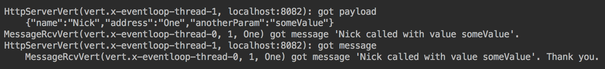

Microservices
=============

In this chapter, you will learn what microservices are, how they are
different from other architectural styles, and how existing microservice
frameworks support message-driven architecture. We will also help you to
decide on the size of a microservice and discuss whether the service
size plays any role in identifying it as a microservice or not. By the
end of the chapter, you will understand how to build microservices and
use them as the foundational component for creating a reactive system.
We will support the discussion with a detailed code demonstration of a
small reactive system built using the Vert.x toolkit.

The following topics will be covered in this chapter:

-   What is a microservice?
-   The size of a microservice
-   How microservices talk to each other
-   An example of a reactive system of microservices


### Run Java Code
You can run the example by running following command in the terminal:
`java -cp target/learnjava-1.0.jar com.lv.learnjava.ch16_microservices.HttpServerVert.java`

### Run Java Code
You can run the example by running following command in the terminal:
`java -cp target/learnjava-1.0.jar com.lv.learnjava.ch16_microservices.MessageRcvVert.java`

### Run Java Code
You can run the example by running following command in the terminal:
`java -cp target/learnjava-1.0.jar com.lv.learnjava.ch16_microservices.ReactiveSystemDemo.java`

Microservices
=============

With processing loads constantly increasing, the conventional way of
addressing the issue is to add more servers with the same .ear or .war
file deployed and then join them all together in a cluster. This way, a
failed server can be automatically replaced with another one, and the
system will experience no decrease in its performance. The database that
backs all the clustered servers is typically clustered too. 

Increasing the number of clustered servers, however, is far too
coarse-grained a solution for scalability, especially if the processing
bottleneck is localized in only one of many procedures that are running
in the application. Imagine that one particular CPU- or I/O-intensive
process slows down the whole application; adding another server just to
mitigate the problem of only one part of the application may carry too
much of an overhead. 

One way to decrease the overhead is to split the application into tiers:
frontend (or a web tier), middle tier (or an app tier), and backend (or
a backend tier). Each tier can be deployed independently with its own
cluster of servers so that each tier can grow horizontally and remain
independent of the other tiers. Such a solution makes scalability more
flexible; however, at the same, this complicates the deployment process
as more deployable units need to be taken care of.

Another way to guarantee the smooth deployment of each tier could be to
deploy new code in one server at a time – especially if the new code is
designed and implemented with backward compatibility in mind. This
approach works fine for the front and middle tiers, but may not be as
smooth for the backend. Added to this are unexpected outages during the
deployment process that are caused by human error, defects in the code,
pure accident, or a combination of all of these – thus, it is easy to
understand why very few people look forward to the deployment process of
a major release during production.

Yet, breaking the application into tiers may still be too coarse. In
this case, some of the critical parts of the application, especially
those that require more scaling than others, can be deployed in their
own cluster of servers, and simply provide *services* to other parts of
the system.

In fact, this is how **Service-Oriented Architecture** (**SOA**) was
born. The complication that arose from increasing the number of
deployable units was partially offset when independently deployed
services were identified not only by their need for scalability but also
by how often the code in them was changed. Early identification of this
during the design process simplifies the deployment because only a few
parts need to be changed and redeployed more often than the other parts
of the system. Unfortunately, it is not easy to predict how the future
system is going to evolve. That is why an independent deployment unit is
often identified as a precaution because it is easier to do this during
design time as opposed to later on. And this, in turn, leads to a
continual decrease in the size of the deployable units. 

Unfortunately, maintaining and coordinating a loose system of services
comes at a price. Each participant has to be responsible for maintaining
its API not only in formal terms (such as names and types) but also in
spirit: the results produced by a new version of the same service have
to be the same in terms of scale. Keeping the same value by type but
then making it bigger or smaller in terms of scale would probably be
unacceptable to the clients of the service. So, despite the declared
independence, the service authors have to be more aware of who their
clients are and what their needs are. 

Fortunately, splitting an application into independently deployable
units has brought several unexpected benefits that have increased the
motivation for breaking a system into smaller services. The physical
isolation allows more flexibility in choosing a programming language and
the implementation platform. It also helps you to select technology that
is the best for the job and to hire specialists who are able to
implement it. By doing so, you are not bound by the technology choices
made for the other parts of the system. This has also helped recruiters
be more flexible when it comes to finding necessary talent, which is a
big advantage as the demand for work continues to outpace the inflow of
specialists into the job market.

Each independent part (service) is able to evolve at its own pace and
become more sophisticated as long as the contract with the other parts
of the system does not change or is introduced in a well-coordinated
manner. This is how microservices came into being, and they have since
been put to work by the giants of data processing, such as Netflix,
Google, Twitter, eBay, Amazon, and Uber. Now let's talk about the
results of this effort and the lessons learned.


Microservices
=============

There is no universal answer to the question *How small does a
microservice have to be?* The general consensus aligns itself with the
following characteristics of a microservice (in no particular order):

-   The size of the source code should be smaller than that of the
    service in SOA architecture.
-   One development team should be able to support several
    microservices, and the size of the team should be such that two
    pizzas are enough to provide lunch for the whole team.
-   It has to be deployable and independent of other microservices,
    assuming there is no change in the contract (that is, the API).
-   Each microservice has to have its own database (or schema, or set of
    tables, at least) – although, this is a subject of debate,
    especially in cases where several microservices are able to modify
    the same dataset; if the same team maintains all of them, it is
    easier to avoid a conflict while modifying the same data
    concurrently.
-   It has to be stateless and idempotent; if one instance of the
    microservice has failed, another one should be able to accomplish
    what was expected from the failed microservice.
-   It should provide a way to check its *health*, which proves that the
    service is up and running, has all the necessary resources, and is
    ready to do the job. 

The sharing of resources needs to be considered during the design
process, development, and after deployment and monitored for the
validation of the assumptions about the degree of interference
(blocking, for example) while accessing the same resource from
different processes. Special care also needs to be taken during the
modification process of the same persistent data whether shared across
databases, schemas, or just tables within the same schema. If *eventual
consistency* is acceptable (which is often the case for larger sets of
data used for statistical purposes), then special measures are
necessary. But the need for transactional integrity poses an often
difficult problem.

One way to support a transaction across several microservices is to
create a service that will play the role of a **Distributed Transaction
Manager** (**DTM**). In this way, other services can pass requests for
data modification to it. The DTM service can keep the concurrently
modified data in its own database table and move the results into the
target table(s) in one transaction only after the data becomes
consistent. For example, money can be added to an account by one
microservice only when the corresponding amount is added to a ledger by
another microservice.

If the time taken to access the data is an issue, or if you need to
protect the database from an excessive number of concurrent connections,
dedicating a database to a microservice may be the solution.
Alternatively, a memory cache may be the way to go. Adding a service
that provides access to the cache increases the isolation of the
services, but requires synchronization between the peers that are
managing the same cache (which is sometimes difficult).

After reviewing all the listed points and possible solutions, the size
of each microservice should depend on the result of these
considerations, and not as a blank statement of size imposed on all the
services. This helps to avoid unproductive discussions and produce a
result that is tailored to address a particular project and its needs. 


Microservices
=============

To demonstrate how a reactive system of microservices may look if
implemented using Vert.x, we are going to create an HTTP server that can
accept a REST-based request to the system, send an EventBus-based
message to another verticle, receive a reply, and send the response back
to the original request.

To demonstrate how it all works, we will also write a program that
generates HTTP requests to the system and allows you to test the system
from outside.

The HTTP server
---------------

Let's assume that the entry point into the reactive system demonstration
is going to be an HTTP call. This means that we need to create a
verticle that acts as an HTTP server. Vert.x makes this really easy; the
following three lines in a verticle will do the trick:

```
HttpServer server = vertx.createHttpServer();server.requestStream().toObservable()      .subscribe(request -> request.response()                .setStatusCode(200)                .end("Hello from " + name + "!\n")      );server.rxListen(port).subscribe();
```

As you can see, the created server listens to the specified port and
responds with Hello... to each incoming request. By default, the
hostname is localhost. If necessary, another address for the host can be
specified using an overloaded version of the same method:

```
server.rxListen(port, hostname).subscribe();
```

Here is the entire code of the verticle that we have created:

```
package com.packt.learnjava.ch16_microservices;import io.vertx.core.Future;import io.vertx.rxjava.core.AbstractVerticle;import io.vertx.rxjava.core.http.HttpServer;public class HttpServerVert extends AbstractVerticle {    private int port;    public HttpServerVert(int port) { this.port = port; }    public void start(Future<Void> startFuture) {        String name = this.getClass().getSimpleName() +                        "(" + Thread.currentThread().getName() +                                             ", localhost:" + port + ")";        HttpServer server = vertx.createHttpServer();        server.requestStream().toObservable()              .subscribe(request -> request.response()                        .setStatusCode(200)                        .end("Hello from " + name + "!\n")              );        server.rxListen(port).subscribe();        System.out.println(name + " is waiting...");    }}
```

We can deploy this server using the following code:

```
Vertx vertx = Vertx.vertx();RxHelper.deployVerticle(vertx, new HttpServerVert(8082));
```

The result will look as follows:


Notice that the ...is waiting... message appears immediately, even
before any request has come in – that is the asynchronous nature of this
server. The name prefix is constructed to contain the class name, thread
name, hostname, and port. Notice that the thread name tells us that the
server listens on the event loop thread, 0.

Now we can issue a request to the deployed server using the
curl command; the response will be as follows:


As you can see, we have issued the HTTP GET (default) request and got
back the expected Hello... message with the expected name. 

The following code is a more realistic version of the start() method:

```
Router router = Router.router(vertx);router.get("/some/path/:name/:address/:anotherParam")      .handler(this::processGetSomePath);router.post("/some/path/send")      .handler(this::processPostSomePathSend);router.post("/some/path/publish")      .handler(this::processPostSomePathPublish);vertx.createHttpServer()     .requestHandler(router::handle)     .rxListen(port)     .subscribe();System.out.println(name + " is waiting..."); 
```

Now we use the Router class and send requests to different handlers
depending on the HTTP method (GET or POST) and the path. It requires you
to add the following dependency to the pom.xml file:

```
<dependency>    <groupId>io.vertx</groupId>    <artifactId>vertx-web</artifactId>    <version>3.6.3</version></dependency>
```

The first route has the /some/path/:name/:address/:anotherParam path,
which includes three parameters (name, address, and anotherParam). The
HTTP request is passed inside the RoutingContext object to the following
handler: 

```
private void processGetSomePath(RoutingContext ctx){    ctx.response()       .setStatusCode(200)       .end("Got into processGetSomePath using " +                                         ctx.normalisedPath() + "\n");}
```

The handler simply returns an HTTP code of 200 and a hardcoded message
that is set on the HTTP response object and is returned by the
response() method. Behind the scenes, the HTTP response object comes
from the HTTP request. We have made the first implementation of the
handlers simple for clarity. Later, we will reimplement them in a more
realistic way.

The second route has the /some/path/send path with the following
handler:

```
private void processPostSomePathSend(RoutingContext ctx){    ctx.response()       .setStatusCode(200)       .end("Got into processPostSomePathSend using " +                                         ctx.normalisedPath() + "\n");
```

The third route has the /some/path/publish path with the following
handler:

```
private void processPostSomePathPublish(RoutingContext ctx){    ctx.response()       .setStatusCode(200)       .end("Got into processPostSomePathPublish using " +                                         ctx.normalisedPath() + "\n");}
```

If we deploy our server again and issue HTTP requests to hit each of the
routes, we will see the following screenshot:


The preceding screenshot illustrates that we sent the expected message
to the first HTTP GET request, but received Resource not found in
response to the second HTTP GET request. This is because there is no
/some/path/send route for the HTTP GET request in our server. We then
switched to the HTTP POST request and received the expected messages for
both POST requests.

From the name of the paths, you could guess that we are going to use
the /some/path/send route to send the EventBus message, and
the /some/path/publish route to publish the EventBus message. But before
implementing the corresponding route handlers, let's create a verticle
that is going to receive the EventBus messages.

The EventBus message receiver 
------------------------------

The implementation of the message receiver is pretty straightforward:

```
vertx.eventBus()     .consumer(address)     .toObservable()     .subscribe(msgObj -> {            String body = msgObj.body().toString();            String msg = name + " got message '" + body + "'.";            System.out.println(msg);            String reply = msg + " Thank you.";            msgObj.reply(reply);     }, Throwable::printStackTrace );
```

The EventBus object can be accessed via the vertx object. The
consumer(address) method of the EventBus class allows you to set the
address that is associated with this message receiver and
returns MessageConsumer\<Object\>. We then convert this object to
Observable and subscribe to it, waiting for the message to be received
asynchronously. The subscribe() method has several overloaded versions.
We have selected one that accepts two functions: the first is called for
each of the emitted values (for each received message, in our case); the
second is called when an exception is thrown anywhere in the pipeline
(that is, it acts like the all-embracing try...catch block). The
MessageConsumer\<Object\> class indicates that, in principle, the
message can be represented by an object of any class. As you can see, we
have decided that we are going to send a string, so we just cast the
message body to String. The MessageConsumer\<Object\> class also has a
reply(Object) method that allows you to send a message back to the
sender.

The full implementation of the message-receiving verticle is as follows:

```
package com.packt.learnjava.ch16_microservices;import io.vertx.core.Future;import io.vertx.rxjava.core.AbstractVerticle;public class MessageRcvVert extends AbstractVerticle {    private String id, address;    public MessageRcvVert(String id, String address) {        this.id = id;        this.address = address;    }    public void start(Future<Void> startFuture) {        String name = this.getClass().getSimpleName() +                     "(" + Thread.currentThread().getName() +                                    ", " + id + ", " + address + ")";        vertx.eventBus()             .consumer(address)             .toObservable()             .subscribe(msgObj -> {                    String body = msgObj.body().toString();                    String msg = name + " got message '" + body + "'.";                    System.out.println(msg);                    String reply = msg + " Thank you.";                    msgObj.reply(reply);             }, Throwable::printStackTrace );        System.out.println(name + " is waiting...");    }}
```

We can deploy this verticle in the same way that we deployed the
HttpServerVert verticle:

```
String address = "One";Vertx vertx = Vertx.vertx();RxHelper.deployVerticle(vertx, new MessageRcvVert("1", address));
```

If we run this code, the following message will be displayed:


As you can see, the last line of MessageRcvVert is reached and executed,
while the created pipeline and the functions we have passed to its
operators are waiting for the message to be sent. So, let's go ahead and
do that now.

The EventBus message senders 
-----------------------------

As we have promised, we will now reimplement the handlers of
the HttpServerVert verticle in a more realistic manner. The GET method
handler now looks like the following code block:

```
private void processGetSomePath(RoutingContext ctx){    String caller = ctx.pathParam("name");    String address = ctx.pathParam("address");    String value = ctx.pathParam("anotherParam");    System.out.println("\n" + name + ": " + caller + " called.");    vertx.eventBus()         .rxSend(address, caller + " called with value " + value)         .toObservable()         .subscribe(reply -> {            System.out.println(name +                            ": got message\n    " + reply.body());            ctx.response()               .setStatusCode(200)               .end(reply.body().toString() + "\n");        }, Throwable::printStackTrace);}
```

As you can see, the RoutingContext class provides
the pathParam() method, which extracts parameters from the path (if they
are marked with :, as in our example). Then, again, we use the EventBus
object to send a message asynchronously to the address provided as a
parameter. The subscribe() method uses the provided function to process
the reply from the message receiver and to send the response back to the
original request to the HTTP server.

Let's now deploy both verticles – the HttpServerVert and the
MessageRcvVert verticles:

```
String address = "One";Vertx vertx = Vertx.vertx();RxHelper.deployVerticle(vertx, new MessageRcvVert("1", address));RxHelper.deployVerticle(vertx, new HttpServerVert(8082));
```

When we run the preceding code, the screen displays the following
messages:


Notice that each of the verticles is run on its own thread. Now we can
submit the HTTP GET request using the curl command; the result is as
follows:


This is how the interaction is viewed from outside our demonstration
system. Inside, we can also see the following messages, which allow us
to trace how our verticles interact and send messages to each other:


The result looks exactly as expected.

Now, the handler for the /some/path/send path is as follows:

```
private void processPostSomePathSend(RoutingContext ctx){   ctx.request().bodyHandler(buffer -> {       System.out.println("\n" + name + ": got payload\n    " + buffer);       JsonObject payload = new JsonObject(buffer.toString());       String caller = payload.getString("name");       String address = payload.getString("address");       String value = payload.getString("anotherParam");       vertx.eventBus()            .rxSend(address, caller + " called with value " + value)            .toObservable()            .subscribe(reply -> {                System.out.println(name +                                   ": got message\n    " + reply.body());                ctx.response()                   .setStatusCode(200)                   .end(reply.body().toString() + "\n");            }, Throwable::printStackTrace);   });}
```

For an HTTP POST request, we expect a payload in the JSON format to be
sent with the same values that we sent as the parameters for the HTTP
GET request. The rest of the method is very similar to
the processGetSomePath() implementation. Let's deploy
the HttpServerVert and MessageRcvVert verticles again, and then issue
the HTTP POST request with a payload; the result will be as follows:


This looks exactly like the result of the HTTP GET request, as was
designed. At the backend, the following messages are displayed:



There is nothing new in these messages either, except that the JSON
format is displayed.

Finally, let's take a look at the handler of the HTTP POST request for
the /some/path/publish path:

```
private void processPostSomePathPublish(RoutingContext ctx){   ctx.request().bodyHandler(buffer -> {       System.out.println("\n" + name + ": got payload\n    " + buffer);       JsonObject payload = new JsonObject(buffer.toString());       String caller = payload.getString("name");       String address = payload.getString("address");       String value = payload.getString("anotherParam");       vertx.eventBus()            .publish(address, caller + " called with value " + value);       ctx.response()          .setStatusCode(202)          .end("The message was published to address " +                                                      address + ".\n");    });}
```

This time, we have used the publish() method to send the message. Notice
that this method does not have the ability to receive a reply. That is
because, as we have mentioned already, the publish() method sends
the message to all receivers that are registered with this address. If
we issue an HTTP POST request with the /some/path/publish path, the
result looks slightly different:


Additionally, the messages on the backend look different too:


All of these differences are related to the fact that the server cannot
get back a reply, even though the receiver sends it in exactly the same
way that it does in response to the message sent by the rxSend() method.

In the next section, we will deploy several instances of the sender and
receiver and examine the difference between the message distribution by
the rxSend() and publish() methods.

The reactive system demonstration
---------------------------------

Let's now assemble and deploy a small reactive system using the
verticles created in the previous section:

```
package com.packt.learnjava.ch16_microservices;import io.vertx.rxjava.core.RxHelper;import io.vertx.rxjava.core.Vertx;public class ReactiveSystemDemo {   public static void main(String... args) {      String address = "One";      Vertx vertx = Vertx.vertx();      RxHelper.deployVerticle(vertx, new MessageRcvVert("1", address));      RxHelper.deployVerticle(vertx, new MessageRcvVert("2", address));      RxHelper.deployVerticle(vertx, new MessageRcvVert("3", "Two"));      RxHelper.deployVerticle(vertx, new HttpServerVert(8082));   }}
```

As you can see, we are going to deploy two verticles that use the same
One address to receive messages and one verticle that uses the
Two address. If we run the preceding program, the screen will display
the following messages:


Let's now start sending HTTP requests to our system. First, let's send
the same HTTP GET request three times:


As we have mentioned already, if there are several verticles registered
with the same address, the rxSend() method uses a round-robin algorithm
to select the verticle that should receive the next message. The first
request went to the receiver with ID="1", the second request went to the
receiver with ID="2", and the third request went to the receiver with
ID="1" again.

We get the same results using the HTTP POST request for the
/some/path/send path:


Again, the receiver of the message is rotated using the round-robin
algorithm.

Now, let's publish a message to our system twice:


Since the receiver's reply cannot propagate back to the system user, we
need to take a look at the messages that are logged on the backend:


As you can see, the publish() method sends the message to all verticles
that are registered to the specified address. And note that the verticle
with ID="3" (registered with the Two address) never received a message.

Before we wrap up this reactive system demonstration, it is worth
mentioning that Vert.x allows you to easily cluster verticles. You can
read about this feature in the Vert.x documentation
([https://vertx.io/docs/vertx-core/](https://vertx.io/docs/vertx-core/java)[java](https://vertx.io/docs/vertx-core/java)).


Microservices
=============

In this chapter, the reader was introduced to the concept of
microservices and how they can be used to create a reactive system. We
discussed the significance of the size of an application and how this
can affect your decision to convert it into a microservice. You also
learned how existing microservice frameworks support message-driven
architecture and had a chance to use one of them – the Vert.x toolkit –
in practice.

In the next chapter, we are going to explore the **Java Microbenchmark
Harness** (**JMH**) project, which allows you to measure code
performance and other parameters. We will define what JMH is, how to
create and run a benchmark, what the benchmark parameters are, and the
supporting IDE plugins.
