Java Microbenchmark Harness
===========================

In this chapter, the reader will be introduced to a **Java
Microbenchmark Harness** (**JMH**) project that allows for measuring
various code performance characteristics. If performance is an important
issue for your application, this tool can help you to identify
bottlenecks with precision—up to the method level. Using it, the reader
will be able to not only measure the average execution time of the code
and other performance values (such as throughput, for example) but to do
it in a controlled manner—with or without the JVM optimizations,
warmup runs, and so on.

In addition to theoretical knowledge, the reader will have a chance to
run JMH using practical demo examples and recommendations.

The following topics will be covered in this chapter:

-   What is JMH?
-   Creating a JMH benchmark
-   Running the benchmark
-   Using the IDE plugin
-   JMH benchmark parameters
-   JMH usage examples


Java Microbenchmark Harness
===========================

According to the dictionary, a **benchmark** is *a standard or point of
reference against which things may be compared or assessed*. In
programming, it is the way to compare the performance of applications,
or just methods. The **micro preface** is focused on the latter—the
smaller code fragments rather than an application as a whole. The JMH is
a framework for measuring the performance of a single method.

That may appear to be very useful. Can we not just run a method a
thousand or a hundred thousand times in a loop, measure how long it
took, and then calculate the average of the method performance? We can.
The problem is that JVM is a much more complicated program than just a
code-executing machine. It has optimization algorithms focused on making
the application code run as fast as possible.

For example, let's look at the following class:

```
class SomeClass {    public int someMethod(int m, int s) {        int res = 0;        for(int i = 0; i < m; i++){            int n = i * i;            if (n != 0 && n % s == 0) {                res =+ n;            }        }        return res;    }}
```

We filled the someMethod() method with code that does not make much
sense but keeps the method busy. To test the performance of this method,
it is tempting to copy the code into some test method and run it in a
loop:

```
public void testCode() {   StopWatch stopWatch = new StopWatch();   stopWatch.start();   int xN = 100_000;   int m = 1000;   for(int x = 0; i < xN; x++) {        int res = 0;        for(int i = 0; i < m; i++){            int n = i * i;            if (n != 0 && n % 250_000 == 0) {                res += n;            }        }    }    System.out.println("Average time = " +                              (stopWatch.getTime() / xN /m) + "ms");}
```

However, JVM will see that the res result is never used and qualify the
calculations as **dead code** (the code section that is never executed).
So, why bother executing this code at all?

You may be surprised to see that the significant complication or
simplification of the algorithm does not affect the performance. That is
because, in every case, the code is not actually executed. 

You may change the test method and pretend that the result is used by
returning it:

```
public int testCode() {   StopWatch stopWatch = new StopWatch();   stopWatch.start();   int xN = 100_000;   int m = 1000;   int res = 0;   for(int x = 0; i < xN; x++) {        for(int i = 0; i < m; i++){            int n = i * i;            if (n != 0 && n % 250_000 == 0) {                res += n;            }        }    }    System.out.println("Average time = " +                              (stopWatch.getTime() / xN / m) + "ms"); return res;}
```

This may convince JVM to execute the code every time, but it is
not guaranteed. The JVM may notice that the input into the calculations
does not change and this algorithm produces the same result every run.
Since the code is based on constant input, this optimization is called
**constant folding**. The result of this optimization is that this code
may be executed only once and the same result is assumed for every run,
without actually executing the code.

In practice though, the benchmark is often built around a method, not a
block of code. For example, the test code may look as follows:

```
public void testCode() {   StopWatch stopWatch = new StopWatch();   stopWatch.start();   int xN = 100_000;   int m = 1000;   SomeClass someClass = new SomeClass();   for(int x = 0; i < xN; x++) {        someClass.someMethod(m, 250_000);    }    System.out.println("Average time = " +                              (stopWatch.getTime() / xN / m) + "ms");}
```

But even this code is susceptible to the same JVM optimization we have
just described.

The JMH was created to help to avoid this, and similar pitfalls. In
the *JMH Usage examples* section, we will show you how to use JMH to
work around the dead code and constants folding optimization, using the
@State annotation and the Blackhole object.

Besides, JMH allows for measuring not only average execution time but
also throughput and other performance characteristics.


Java Microbenchmark Harness
===========================

To start using JMH, the following dependencies have to be added to the
pom.xml file:

```
<dependency>    <groupId>org.openjdk.jmh</groupId>    <artifactId>jmh-core</artifactId>    <version>1.21</version></dependency><dependency>    <groupId>org.openjdk.jmh</groupId>    <artifactId>jmh-generator-annprocess</artifactId>    <version>1.21</version></dependency>
```

The name of the second .jar file, annprocess, provides a hint that JMH
uses annotations. If you guessed so, you were correct. Here is an
example of a benchmark created for testing the performance of an
algorithm:

```
public class BenchmarkDemo {    public static void main(String... args) throws Exception{        org.openjdk.jmh.Main.main(args);    }    @Benchmark    public void testTheMethod() {        int res = 0;        for(int i = 0; i < 1000; i++){            int n = i * i;            if (n != 0 && n % 250_000 == 0) {                res += n;            }        }    }}
```

Please notice the @Benchmark annotation. It tells the framework that
this method performance has to be measured. If you run the preceding
main() method, you will see an output similar to the following:

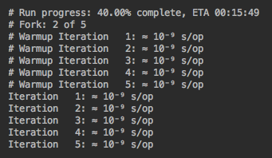

This is only one segment of an extensive output that includes multiple
iterations under different conditions with the goal being to avoid or
offset the JVM optimization. It also takes into account the difference
between running the code once and running it multiple times. In the
latter case, the JVM starts using the just-in-time compiler, which
compiles the often-used bytecodes code into native binary code and does
not even read the bytecodes. The warmup cycles serve this purpose—the
code is executed without measuring its performance as a dry run that
*warms up* the JVM.

There are also ways to tell the JVM which method to compile and use as
binary directly, which method to compile every time, and to provide
similar instructions to disable certain optimization. We will talk about
this shortly.

Let's now see how to run the benchmark.


Java Microbenchmark Harness
===========================

As you have probably guessed, one way to run a benchmark is just to
execute the main() method. It can be done using java command directly or
using the IDE. We talked about it in [Chapter
1](https://subscription.packtpub.com/book/programming/9781789957051/1),
*Getting Started with Java 12*. Yet there is an easier and more
convenient way to run a benchmark: by using an IDE plugin.

Using an IDE plugin
-------------------

All major Java supporting IDEs have such a plugin. We will demonstrate
how to use the plugin for IntelliJ installed on a macOS computer, but it
is equally applicable to Windows systems.

Here are the steps to follow:

1.  To start installing the plugin, press the *command* key and
    comma (*,*) together, or just click the wrench symbol (with the
    hover text Preferences) in the top horizontal menu:

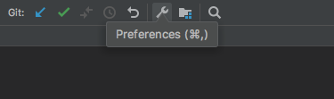

2.  It will open a window with the following menu in the left pane:

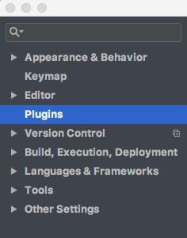

3.  Select Plugins, as shown in the preceding screenshot, and observe
    the window with the following top horizontal menu:

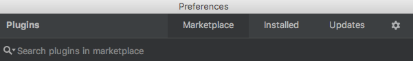

4.  Select Marketplace, type *JMH* in the Search plugins in marketplace
    input field ,and press *Enter*. If you have an internet connection,
    it will show you a JMH plugin symbol, similar to the one shown in
    this screenshot:

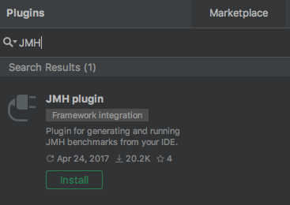

5.  Click the Install button and then, after it turns into Restart
    IDE, click it again:

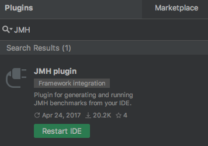

6.  After the IDE restarts, the plugin is ready to be used. Now you can
    not only run the main() method but you can also pick and choose
    which of the benchmark methods to execute if you have several
    methods with the @Benchmark annotation. To do this, select
    Run... from the Run drop-down menu: 

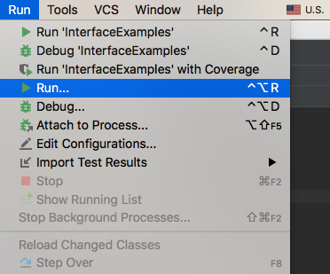

7.  It will bring up a window with a selection of methods you can run:

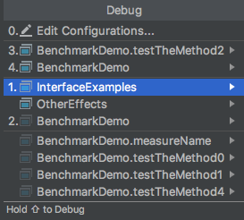

8.  Select the one you would like to run and it will be executed. After
    you have run a method at least once, you can just right-click on it
    and execute it from the pop-up menu:

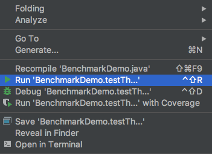

9.  You can also use the shortcuts shown to the right of each menu item.

Now let's review the parameters that can be passed to the benchmark.


Java Microbenchmark Harness
===========================

There are many benchmark parameters that allow for fine-tuning the
measurements for the particular needs of the task at hand. We are going
to present only the major ones.

Mode
----

The first set of parameters defines the performance aspect (mode) the
particular benchmark has to measure:

-   Mode.AverageTime: Measures the average execution time
-   Mode.Throughput: Measures the throughput by calling the benchmark
    method in an iteration
-   Mode.SampleTime: Samples the execution time, instead of averaging
    it; allows us to infer the distributions, percentiles, and so on
-   Mode.SingleShotTime: Measures the single method invocation
    time; allows for the testing of a cold startup without calling the
    benchmark method continuously

These parameters can be specified in the annotation @BenchmarkMode. For
example:

```
@BenchmarkMode(Mode.AverageTime)
```

It is possible to combine several modes:

```
@BenchmarkMode({Mode.Throughput, Mode.AverageTime, Mode.SampleTime, Mode.SingleShotTime}
```

It is also possible to request all of them:

```
@BenchmarkMode(Mode.All)
```

The described parameters and all the parameters we are going to discuss
later in this chapter can be set at the method and/or class level. The
method-level set value overrides the class-level value.

Output time unit
----------------

The unit of time used for presenting the results can be specified using
the @OutputTimeUnit annotation:

```
@OutputTimeUnit(TimeUnit.NANOSECONDS)
```

The possible time units come from
the java.util.concurrent.TimeUnit enum.

Iterations
----------

Another group of parameters defines the iterations used for the warmups
and measurements. For example: 

```
@Warmup(iterations = 5, time = 100, timeUnit = TimeUnit.MILLISECONDS)@Measurement(iterations = 5, time = 100, timeUnit = TimeUnit.MILLISECONDS)
```

Forking
-------

While running several tests, the @Fork annotation allows you to set each
test to be run in a separate process. For example:

```
@Fork(10)
```

The passed-in parameter value indicates how many times the JVM can to be
forked into independent processes. The default value is -1. Without it,
the test's performance can be mixed, if you use several classes
implementing the same interface in tests and they affect each other.

The warmups parameter is another one which can be set to indicate how
many times the benchmark has to execute without collecting measurements:

```
@Fork(value = 10, warmups = 5)
```

It also allows you to add Java options to the java command line. For
example:

```
@Fork(value = 10, jvmArgs = {"-Xms2G", "-Xmx2G"})
```

The full list of JMH parameters and examples of how to use them can be
found in the openjdk project
([http://hg.openjdk.java.net/code-tools/jmh/file/tip/jmh-samples/src/main/java/org/openjdk/jmh/samples](http://hg.openjdk.java.net/code-tools/jmh/file/tip/jmh-samples/src/main/java/org/openjdk/jmh/samples)).
For example, we did not mention @Group, @GroupThreads, @Measurement,
@Setup, @Threads, @Timeout, @TearDown, or @Warmup.


Java Microbenchmark Harness
===========================

Let's now run a few tests and compare them. First, we run the following
test method:

```
@Benchmark@BenchmarkMode(Mode.All)@OutputTimeUnit(TimeUnit.NANOSECONDS)public void testTheMethod0() {    int res = 0;    for(int i = 0; i < 1000; i++){        int n = i * i;        if (n != 0 && n % 250_000 == 0) {            res += n;        }    }}
```

As you can see, we have requested to measure all the performance
characteristics and to use nanoseconds while presenting the results. On
our system, the test execution took around 20 minutes and the final
results summary looked like this:

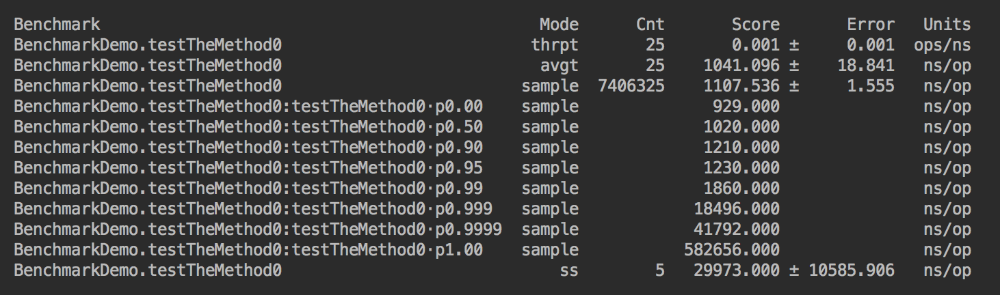

Let's now change the test as follows:

```
@Benchmark@BenchmarkMode(Mode.All)@OutputTimeUnit(TimeUnit.NANOSECONDS)public void testTheMethod1() {    SomeClass someClass = new SomeClass();    int i = 1000;    int s = 250_000;    someClass.someMethod(i, s);}
```

If we run the testTheMethod1() now, the results will be slightly
different:

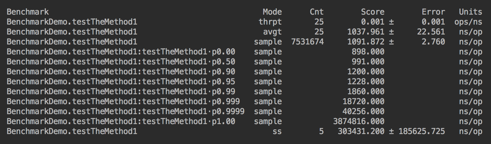

The results are mostly different around sampling and single-shot
running. You can play with these methods and change the forking and
number of warmups. 

Using the @State annotation
---------------------------

This JMH feature allows you to hide the source of the data from the
JVM, thus preventing dead code optimization. You can add a class as the
source of the input data as follows:

```
@State(Scope.Thread)public static class TestState {    public int m = 1000;    public int s = 250_000;}@Benchmark@BenchmarkMode(Mode.All)@OutputTimeUnit(TimeUnit.NANOSECONDS)public int testTheMethod3(TestState state) {    SomeClass someClass = new SomeClass();    return someClass.someMethod(state.m, state.s);}
```

The Scope value is used for sharing data between tests. In our case,
with only one test using the TestCase class object, we do not have a
need for sharing. Otherwise, the value can be set to Scope.Group or
Scope.Benchmark, which means we could add setters to the TestState class
and read/modify it in other tests.

When we ran this version of the test, we got the following results:

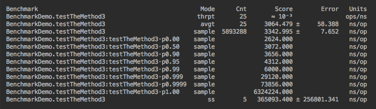

The data has changed again. Notice that the average time for execution
has increased three-fold which indicates that more JVM optimization was
not applied.

Using the Blackhole object
--------------------------

This JMH feature allows for simulating the results usage, thus
preventing the JVM from folding constants optimization:

```
@Benchmark@BenchmarkMode(Mode.All)@OutputTimeUnit(TimeUnit.NANOSECONDS)public void testTheMethod4(TestState state, Blackhole blackhole) {    SomeClass someClass = new SomeClass();    blackhole.consume(someClass.someMethod(state.m, state.s));}
```

As you can see, we have just added a parameter Blackhole object and
called the consume() method on it, thus pretending that the result of
the tested method is used.

When we ran this version of the test, we got the following results:

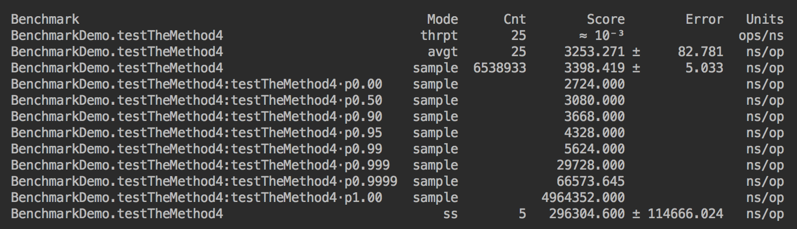

This time, the results look not that different. Apparently, the constant
folding optimization was neutralized even before the Blackhole usage was
added. 

Using the @CompilerControl annotation
-------------------------------------

Another way to tune up the benchmark is to tell the compiler to compile,
inline (or not), and exclude (or not) a particular method from the code.
For example, consider the following class:

```
class SomeClass{     public int oneMethod(int m, int s) {        int res = 0;        for(int i = 0; i < m; i++){            int n = i * i;            if (n != 0 && n % s == 0) {                res = anotherMethod(res, n);            }        }        return res;    }    @CompilerControl(CompilerControl.Mode.EXCLUDE)    private int anotherMethod(int res, int n){        return res +=n;    }}
```

Assuming we are interested in how the method anotherMethod()
compilation/inlining affects the performance, we can set the
CompilerControl mode on it to the following:

-   Mode.INLINE: To force this method inlining
-   Mode.DONT\_INLINE: To avoid this method inlining
-   Mode.EXCLUDE: To avoid this method compiling

Using the @Param annotation
---------------------------

Sometimes, it is necessary to run the same benchmark for a different set
of input data. In such a case, the @Param annotation is very useful.

@Param is a standard Java annotation used by various frameworks, for
example, JUnit. It identifies an array of parameter values. The test
with the @Param annotation will be run as many times as there are values
in the array. Each test execution picks up a different value from the
array.

Here is an example:

```
@State(Scope.Benchmark)public static class TestState1 {    @Param({"100", "1000", "10000"})    public int m;    public int s = 250_000;}@Benchmark@BenchmarkMode(Mode.All)@OutputTimeUnit(TimeUnit.NANOSECONDS)public void testTheMethod6(TestState1 state, Blackhole blackhole) {    SomeClass someClass = new SomeClass();    blackhole.consume(someClass.someMethod(state.m, state.s));}
```

The testTheMethod6() benchmark is going to be used with each of the
listed values of the parameter
m.[](http://hg.openjdk.java.net/code-tools/jmh/file/5984e353dca7/jmh-samples/src/main/java/org/openjdk/jmh/samples/JMHSample_27_Params.java#l73)


Java Microbenchmark Harness
===========================

The described harness takes away most of the worries of the programmer
who measures the performance. And yet, it is virtually impossible to
cover all the cases of JVM optimization, profile sharing, and similar
aspects of the JVM implementation, especially if we take into account
that JVM code evolves and differs from one implementation to another.
The authors of JMH acknowledge this fact by printing the following
warning along with the test results:

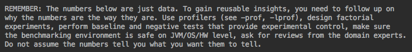

The description of the profilers and their usage can be found in
the openjdk project
([http://hg.openjdk.java.net/code-tools/jmh/file/tip/jmh-samples/src/main/java/org/openjdk/jmh/samples](http://hg.openjdk.java.net/code-tools/jmh/file/tip/jmh-samples/src/main/java/org/openjdk/jmh/samples)).
Among the same samples, you will encounter the description of the code
generated by JMH, based on the annotations.

If you would like to get really deep into the details of your code
execution and testing, there is no better way to do it than to study the
generated code. It describes all the steps and decisions JMH makes in
order to run the requested benchmark. You can find the generated code in
the target/generated-sources/annotations.

The scope of this book does not allow for going into too many details on
how to read it, but it is not very difficult, especially if you start
with a simple case of testing one method only. We wish you all the best
in this endeavor.


Java Microbenchmark Harness
===========================

In this chapter, the reader has learned about the JMH tool and was able
to use it for specific practical cases similar to those they encountered
while programming their applications. The reader has learned how to
create and run a benchmark, how to set the benchmark parameters, and how
to install IDE plugins if needed. We also have provided practical
recommendations and references for further reading.

In the next chapter, readers will be introduced to the useful practices
of designing and writing application code. We will talk about Java
idioms, their implementation and usage, and provide recommendations for
implementing equals(), hashCode(), compareTo(), and clone() methods. We
will also discuss the difference between the usage of the StringBuffer
and StringBuilder classes, how to catch exceptions, best design
practices, and other proven programming practices.
