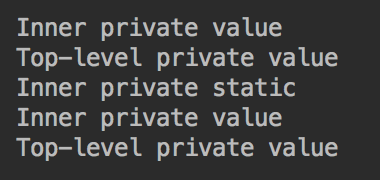

Java Fundamentals
=================

This chapter presents to the reader a more detailed view of Java as a
language. It starts with the code organization in packages and the
description of accessibility levels of classes (interfaces) and their
methods and properties (fields). The reference types, as the main types
of a Java object—oriented nature, are also presented in detail ,
followed by a list of reserved and restricted keywords and a discussion
of their usage. The chapter ends with the methods of conversion between
primitive types and from a primitive type to the corresponding reference
type and back.

These are the Java language fundamental terms and features. The
importance of their understanding cannot be overstated. Without them,
you cannot write any Java program. So, try not to rush through this
chapter and make sure you understand everything presented.

The following topics will be covered in this chapter:

-   Packages, importing, and access
-   Java reference types
-   Reserved and restricted keywords
-   The usage of this and super keywords
-   Converting between primitive types
-   Converting between primitive and reference types 


### Run Java Code
You can run the example by running following command in the terminal:
`java -cp target/learnjava-1.0.jar com.lv.learnjava.ch03_fundamentals.AccessModifiers.java`

### Run Java Code
You can run the example by running following command in the terminal:
`java -cp target/learnjava-1.0.jar com.lv.learnjava.ch03_fundamentals.BoxingUnboxing.java`

### Run Java Code
You can run the example by running following command in the terminal:
`java -cp target/learnjava-1.0.jar com.lv.learnjava.ch03_fundamentals.Packages.java`

### Run Java Code
You can run the example by running following command in the terminal:
`java -cp target/learnjava-1.0.jar com.lv.learnjava.ch03_fundamentals.ReferenceTypes.java`

### Run Java Code
You can run the example by running following command in the terminal:
`java -cp target/learnjava-1.0.jar com.lv.learnjava.ch03_fundamentals.ThisAndSuper.java`

### Run Java Code
You can run the example by running following command in the terminal:
`java -cp target/learnjava-1.0.jar com.lv.learnjava.ch03_fundamentals.WideningNarrowing.java`

Java Fundamentals
=================

As you already know, the package name reflects the directory structure,
starting with the project directory that contains the .java files. The
name of each .java file has to be the same as the name of the top—level
class declared in it (this class can contain other classes). The first
line of the .java file is the package statement that starts with the
package keyword, followed by the actual package name – the directory
path to this file in which slashes are replaced with dots. 

A package name and the class name together compose a **fully qualified
class name**. It uniquely identifies the class, but tends to be too long
and inconvenient to use. That is when **importing** comes to the rescue,
by allowing specification of the fully qualified name only once, and
then referring to the class only by the class name.

Invoking a method of a class from the method of another class is
possible only if the caller has access to that class and its methods.
The access modifiers public, protected, and private define the level of
accessibility and allow (or disallow) some methods, properties, or even
the class itself to be visible to other classes.

All these aspects will be discussed in detail in the current section.

Packages
--------

Let's look at the class we called Packages:

```
package com.packt.learnjava.ch03_fundamentals;import com.packt.learnjava.ch02_oop.hiding.C;import com.packt.learnjava.ch02_oop.hiding.D;public class Packages {    public void method(){        C c = new C();        D d = new D();    }}
```

The first line in the Packages class is a package declaration that
identifies the class location on the source tree or, in other words,
the .java file location in a filesystem. When the class is compiled and
its .class file with bytecode is generated, the package name also
reflects the .class file location in the filesystem. 

Importing 
----------

After the package declaration, the import statements follow. As you can
see from the previous example, they allow use of of the fully qualified
class (or interface) name to be avoided anywhere else in the current
class. When many classes (and interfaces) from the same package are
imported, it is possible to import all classes and interfaces from the
same package as a group, using the symbol \*. In our example, it would
look as follows:

```
import com.packt.learnjava.ch02_oop.hiding.*;
```

But that is not recommended practice, as it hides away the imported
class (and interface) location when several packages are imported as a
group. For example, look at this code snippet:

```
package com.packt.learnjava.ch03_fundamentals;import com.packt.learnjava.ch02_oop.*;import com.packt.learnjava.ch02_oop.hiding.*;public class Packages {    public void method(){        C c = new C();        D d = new D();    }}
```

In the preceding code, can you guess to which package a class C or class
D belongs? Also, it is possible that two classes in different packages
have the same name. If that is the case, group importing can create a
degree confusion or even a problem difficult to nail down.

It is also possible to import individual static class (or interface)
members. For example, if SomeInterface has a NAME property (to remind
you, interface properties are public and static by default), you can
typically refer to it as follows:

```
package com.packt.learnjava.ch03_fundamentals;import com.packt.learnjava.ch02_oop.SomeInterface;public class Packages {    public void method(){        System.out.println(SomeInterface.NAME);    }}
```

To avoid using even the interface name, you can use a static import:

```
package com.packt.learnjava.ch03_fundamentals;import static com.packt.learnjava.ch02_oop.SomeInterface.NAME;public class Packages {    public void method(){        System.out.println(NAME);    }}
```

Similarly, if SomeClass has a public static property, someProperty, and
a public static method, someMethod(), it is possible to import them
statically too:

```
package com.packt.learnjava.ch03_fundamentals;import com.packt.learnjava.ch02_oop.StaticMembers.SomeClass;import com.packt.learnjava.ch02_oop.hiding.C;import com.packt.learnjava.ch02_oop.hiding.D;import static com.packt.learnjava.ch02_oop.StaticMembers                                          .SomeClass.someMethod;import static com.packt.learnjava.ch02_oop.StaticMembers                                          .SomeClass.SOME_PROPERTY;public class Packages {    public static void main(String... args){        C c = new C();        D d = new D();        SomeClass obj = new SomeClass();        someMethod(42);        System.out.println(SOME_PROPERTY);    //prints: abc    }}
```

But this technique should be used wisely since it may create an
impression that a statically imported method or property belongs to the
current class.

Access modifiers
----------------

We have already used in our examples the three access modifiers–
public, protected, and private–which regulate access to the classes,
interfaces, and their members from outside–from other classes or
interfaces. There is also a fourth implicit one (also called **default
modifier package-private**) that is applied when none of the three
explicit access modifiers is specified.

The effect of their usage is pretty straightforward:

-   public: Accessible to other classes and interfaces of the current
    and other packages
-   protected: Accessible only to other members of the same package and
    children of the class
-   No access modifier means *accessible only to other members of the
    same package*
-   private: Accessible only to members of the same class

From inside the class or an interface, all the class or interface
members are always accessible. Besides, as we have stated several times
already, all interface members are public by default, unless declared
as private.

Also, please note that class accessibility supersedes the class members'
accessibility because, if the class itself is not accessible from
somewhere, no change in the accessibility of its methods or properties
can make them accessible.

When people talk about access modifiers for classes and interfaces, they
mean the classes and interfaces that are declared inside other classes
or interfaces. The encompassing class or interface is called
a* top-level class or interface*, while those inside them are called
**inner classes or interfaces**. The static inner classes are also
called **static nested classes**.

It does not make sense to declare a top-level class or
interface private because it will not be accessible from anywhere. And
the Java authors decided against allowing the top-level class or
interface to be declared protected too. It is possible, though, to have
a class without an explicit access modifier, thus making it accessible
only to the members of the same package.

Here is an example:

```
public class AccessModifiers {    String prop1;    private String prop2;    protected String prop3;    public String prop4;        void method1(){ }    private void method2(){ }    protected void method3(){ }    public void method4(){ }    class A1{ }    private class A2{ }    protected class A3{ }    public class A4{ }    interface I1 {}    private interface I2 {}    protected interface I3 {}    public interface I4 {}}
```

Please note that static nested classes* *do not have access to other
members of the top-level class.

Another particular feature of an inner class is that it has access to
all, even private members, of the top-level class, and vice versa. To
demonstrate this feature, let's create the following private properties
and methods in the top-level class and in a private inner class:

```
public class AccessModifiers {    private String topLevelPrivateProperty = "Top-level private value";    private void topLevelPrivateMethod(){        var inner = new InnerClass();        System.out.println(inner.innerPrivateProperty);        inner.innerPrivateMethod();    }    private class InnerClass {        //private static String PROP = "Inner static"; //error        private String innerPrivateProperty = "Inner private value";        private void innerPrivateMethod(){            System.out.println(topLevelPrivateProperty);        }    }    private static class InnerStaticClass {        private static String PROP = "Inner private static";        private String innerPrivateProperty = "Inner private value";        private void innerPrivateMethod(){            var top = new AccessModifiers();            System.out.println(top.topLevelPrivateProperty);        }    }}
```

As you can see, all the methods and properties in the previous classes
are private, which means that normally, they are not accessible from
outside the class. And that is true for the AccessModifiers class: its
private methods and properties are not accessible for other classes that
are declared outside of it. But the InnerClass class can access the
private members of the top-level class, while the top-level class can
access the private members of its inner classes. The only limitation is
that a non-static inner class cannot have static members. By contrast, a
static nested class can have both static and non-static members, which
makes a static nested class much more usable.

To demonstrate all the possibilities described, we add the following
main() method to the  AccessModifiers  class:

```
public static void main(String... args){    var top = new AccessModifiers();    top.topLevelPrivateMethod();    //var inner = new InnerClass();  //error    System.out.println(InnerStaticClass.PROP);    var inner = new InnerStaticClass();    System.out.println(inner.innerPrivateProperty);    inner.innerPrivateMethod();}
```

Naturally, a non-static inner class cannot be accessed from a static
context of the top-level class, hence the comment in the preceding code.
If we run it, the result will be as follows:

 

The first two lines of the output come from the topLevelPrivateMethod(),
the rest from the main() method. As you can see, an inner and a
top-level class can access each other's private state, inaccessible from
outside.


Java Fundamentals
=================

A new operator creates an object of a class and returns the reference to
the memory where the object resides. From a practical standpoint, the
variable that holds this reference is treated in the code as if it is
the object itself. Such a variable can be a class, an interface, an
array, or a null literal that indicates that no memory reference is
assigned to the variable. If the type of the reference is an interface,
it can be assigned either null or a reference to the object of the class
that implements this interface because the interface itself cannot be
instantiated.

JVM watches for all the created objects and checks whether there are
references to each of them in the currently executed code. If there is
an object without any reference to it, JVM removes it from the memory in
the process called **garbage collection**. We will describe this process
in [Chapter
9](https://subscription.packtpub.com/book/programming/9781789957051/9),
*JVM Structure and Garbage Collection*. For example, an object was
created during a method execution and was referred to by the local
variable. This reference will disappear as soon as the method finishes
its execution.

You have seen the examples of custom classes and interfaces, and we have
talked about the String class already (see [Chapter
1](https://subscription.packtpub.com/book/programming/9781789957051/1),
*Getting Started with Java 12*). In this section, we will also describe
two other Java reference types–array and enum–and demonstrate how to use
them. 

Class and interface
-------------------

A variable of a class type is declared using the corresponding class
name:

```
<Class name> identifier;
```

The value that can be assigned to such a variable can be one of the
following:

-   A reference type null literal (means the variable can be used but
    does not refer to any object)
-   A reference to an object of the same class or any of its descendants
    (because a descendant inherits the types of all of its ancestors) 

This last type of assignment is called a **widening assignment** because
it forces a specialized reference to become less specialized. For
example, since every Java class is a subclass of java.lang.Object, the
following assignment can be done for any class:

```
Object obj = new AnyClassName();
```

Such an assignment is also called an **upcasting** because it moves the
type of the variable up on the line of inheritance (which, like any
family tree, is usually presented with the oldest ancestor at the top).

After such an upcasting, it is possible to make a narrowing assignment
using a cast operator (type):

```
AnyClassName anyClassName = (AnyClassName)obj;
```

Such an assignment is also called a **downcasting** and allows you to
restore the descendant type. To apply this operation, you have to be
sure that the identifier in fact refers to a descendant type. If in
doubt, you can use the instanceof operator (see [Chapter
2](https://subscription.packtpub.com/book/programming/9781789957051/2),
*Java Object-Oriented Programming*) to check the reference type.

Similarly, if a class implements a certain interface, its object
reference can be assigned to this interface or any ancestor of the
interface:

```
interface C {}interface B extends C {}class A implements B { }B b = new A();C c = new A();A a1 = (A)b;A a2 = (A)c;
```

As you can see, as in the case with class reference upcasting and
downcasting, it is possible to recover the original type of the object
after its reference was assigned to a variable of one of the implemented
interfaces types. 

The material of this section can also be viewed as another demonstration
of Java polymorphism in action.

Array
-----

An **array** is a reference type and, as such, extends the
java.lang.Object class too. The array elements have the same type as the
declared array type. The number of elements may be zero, in which case
the array is said to be an empty array. Each element can be accessed by
an index, which is a positive integer or zero. The first element has an
index of zero. The number of elements is called an array length. Once an
array is created, its length never changes.

The following are examples of an array declaration:

```
int[] intArray;float[][] floatArray;String[] stringArray;SomeClass[][][] arr;
```

Each bracket pair indicates another dimension. The number of bracket
pairs is the nesting depth of the array:

```
int[] intArray = new int[10];float[][] floatArray = new float[3][4];String[] stringArray = new String[2];SomeClass[][][] arr = new SomeClass[3][5][2];
```

The new operator allocates memory for each element that can be assigned
(filled with) a value later. But the elements of an array are
initialized to the default values at creation time in my case, as the
following example demonstrates:

```
System.out.println(intArray[3]);      //prints: 0System.out.println(floatArray[2][2]); //prints: 0.0System.out.println(stringArray[1]);   //prints: null
```

Another way to create an array is to use an array
initializer–comma-separated list of values enclosed in braces for each
dimension, for example:

```
int[] intArray = {1,2,3,4,5,6,7,8,9,10};float[][] floatArray ={{1.1f,2.2f,3,2},{10,20.f,30.f,5},{1,2,3,4}};String[] stringArray = {"abc", "a23"};System.out.println(intArray[3]);      //prints: 4System.out.println(floatArray[2][2]); //prints: 3.0System.out.println(stringArray[1]);   //prints: a23
```

A multidimensional array can be created without declaring the length of
each dimension. Only the first dimension has to have the length
specified:

```
float[][] floatArray = new float[3][];System.out.println(floatArray.length);  //prints: 3System.out.println(floatArray[0]);      //prints: nullSystem.out.println(floatArray[1]);      //prints: nullSystem.out.println(floatArray[2]);      //prints: null//System.out.println(floatArray[3]);    //error//System.out.println(floatArray[2][2]); //error
```

The missing length of other dimensions can be specified later:

```
float[][] floatArray = new float[3][];floatArray[0] = new float[4];floatArray[1] = new float[3];floatArray[2] = new float[7];System.out.println(floatArray[2][5]);   //prints: 0.0
```

This way, it is possible to assign a different length to different
dimensions. Using the array initializer, it is also possible to create
dimensions of different lengths:

```
float[][] floatArray ={{1.1f},{10,5},{1,2,3,4}};
```

The only requirement is that a dimension has to be initialized before it
can be used.

Enum
----

The **enum** reference type class extends the java.lang.Enum class,
which, in turn, extends java.lang.Object. It allows the specification of
a limited set of constants, each of them an instance of the same type.
The declaration of such a set starts with the keyword, enum. Here is an
example:

```
enum Season { SPRING, SUMMER, AUTUMN, WINTER }
```

Each of the listed items – SPRING, SUMMER, AUTUMN, and WINTER – is an
instance of a Season  type. They are the only four instances the Season
class can have. They are created in advance and can be used everywhere
as a value of a Season type. No other instance of the Season class can
be created. And that is the reason for the creation of the enum type: it
can be used for cases when the list of instances of a class has to be
limited to the fixed set.

The enum declaration can also be written in a camel case:

```
enum Season { Spring, Summer, Autumn, Winter }
```

However, the all-capitals style is used more often, because, as we have
mentioned earlier, there is a convention to express the static final
constant's identifier in a capital case. It helps to distinguish
constants from variables. The enum constants are static and final
implicitly.

Because the enum values are constants, they exist uniquely in JVM and
can be compared by reference:

```
Season season = Season.WINTER;boolean b = season == Season.WINTER;System.out.println(b);   //prints: true
```

The following are the most frequently used methods of
the java.lang.Enum class:

-   name(): returns the enum constant's identifier as it is spelled when
    declared (WINTER, for example).
-   toString(): returns the same value as the name() method by default,
    but can be overridden to return any other String value.
-   ordinal(): returns the position of the enum constant when declared
    (the first in the list has a 0 ordinal value).
-   valueOf(Class enumType, String name): returns the enum constant
    object by its name expressed as a String literal.
-   values(): a static method not described in the documentation of the
    java.lang.Enum class. In the *Java Language Specification*, *section
    8.9.3*
    ([https://docs.oracle.com/javase/specs/jls/se12/html/jls-8.html\#jls-8.9.3](https://docs.oracle.com/javase/specs/jls/se12/html/jls-8.html#jls-8.9.3)),
    it is described as implicitly declared. *The Java™ Tutorials*
    ([https://docs.oracle.com/javase/tutorial/java/javaOO/enum.html](https://docs.oracle.com/javase/tutorial/java/javaOO/enum.html))
    states that the compiler automatically adds some special methods
    when it creates an enum, among them, a static values() method that
    returns an array containing all of the values of the enum in the
    order they are declared.

To demonstrate the preceding methods, we are going to use the already
familiar enum, Season:

```
enum Season { SPRING, SUMMER, AUTUMN, WINTER }
```

And here is the demo code:

```
System.out.println(Season.SPRING.name());            //prints: SPRINGSystem.out.println(Season.WINTER.toString());        //prints: WINTERSystem.out.println(Season.SUMMER.ordinal());         //prints: 1Season season = Enum.valueOf(Season.class, "AUTUMN");System.out.println(season == Season.AUTUMN);         //prints: truefor(Season s: Season.values()){    System.out.print(s.name() + " ");                                //prints: SPRING SUMMER AUTUMN WINTER}
```

To override the toString() method, let's create enum Season1:

```
enum Season1 {    SPRING, SUMMER, AUTUMN, WINTER;    public String toString() {        return this.name().charAt(0) +                this.name().substring(1).toLowerCase();    }}
```

Here is how it works:

```
for(Season1 s: Season1.values()){    System.out.print(s.toString() + " ");                                  //prints: Spring Summer Autumn Winter}
```

It is possible to add any other property to each enum constant. For
example, let's add an average temperature value to each enum instance:\
 SPRING(42), SUMMER(67), AUTUMN(32), WINTER(20);\
 private int temperature;\
 Season2(int temperature){\
 this.temperature = temperature;\
 }\
 public int getTemperature(){\
 return this.temperature;\
 }\
 public String toString() {\
 return this.name().charAt(0) +\
 this.name().substring(1).toLowerCase() +\
 "(" + this.temperature + ")";\
 }\
 }

If we iterate over values of enum Season2, the result will be as
follows:

```
for(Season2 s: Season2.values()){    System.out.print(s.toString() + " ");               //prints: Spring(42) Summer(67) Autumn(32) Winter(20)}
```

In the standard Java libraries, there are several enum classes, for
example, java.time.Month, java.time.DayOfWeek, and
java.util.concurrent.TimeUnit. 

Default values and literals 
----------------------------

As we have  already seen, the default value of a reference type is null.
Some sources call it **special type null**, but Java Language
Specification qualifies it as a literal. When an instance property or an
array of a reference type is initialized automatically (when a value is
not assigned explicitly), the assigned value is null. 

The only reference type that has a literal other than the null literal
is the String class. We discussed strings in [Chapter
1](https://subscription.packtpub.com/book/programming/9781789957051/1),
*Getting Started with Java 12*.

Reference type as a method parameter
------------------------------------

When a primitive type value is passed into a method, we use it. If we do
not like the value passed into the method, we change it as we see fit
and do not think twice about it:

```
void modifyParameter(int x){    x = 2;}
```

We have no concerns that the variable value outside the method may
change:

```
int x = 1;modifyParameter(x);System.out.println(x);  //prints: 1
```

It is not possible to change the parameter value of a primitive type
outside the method because a primitive type parameter is passed into the
method *by value*. This means that the copy of the value is passed into
the method, so even if the code inside the method assigns a different
value to it, the original value is not affected.

Another issue with a reference type is that even though the reference
itself is passed by value, it still points to the same original object
in the memory, so the code inside the method can access the object and
modify it. To demonstrate it, let's create a DemoClass and the method
that uses it:

```
class DemoClass{    private String prop;    public DemoClass(String prop) { this.prop = prop; }    public String getProp() { return prop; }    public void setProp(String prop) { this.prop = prop; }}void modifyParameter(DemoClass obj){    obj.setProp("Changed inside the method");}
```

If we use the preceding method, the result will be as follows: 

```
DemoClass obj = new DemoClass("Is not changed");modifyParameter(obj);System.out.println(obj.getProp()); //prints: Changed inside the method
```

That is a big difference, isn't it? So, you have to be careful not to
modify the passed-in object in order to avoid an undesirable effect.
However, this effect is occasionally used to return the result. But it
does not belong to the list of best practices because it makes code less
readable. Changing the passed-in object is like using a secret tunnel
that is difficult to notice. So, use it only when you have to.

Even if the passed-in object is a class that wraps a primitive value,
this effect still holds (we will talk about primitive values wrapping
type in the *Conversion between primitive and reference
types* section). Here is DemoClass1 and an overloaded version of
the modifyParameter() method:

```
class DemoClass1{    private Integer prop;    public DemoClass1(Integer prop) { this.prop = prop; }    public Integer getProp() { return prop; }    public void setProp(Integer prop) { this.prop = prop; }}void modifyParameter(DemoClass1 obj){    obj.setProp(Integer.valueOf(2));}
```

If we use the preceding method, the result will be as follows: 

```
DemoClass1 obj = new DemoClass1(Integer.valueOf(1));modifyParameter(obj);System.out.println(obj.getProp());  //prints: 2
```

The only exception to this behavior of reference types is an object of
the String class. Here is another overloaded version of
the modifyParameter() method:

```
void modifyParameter(String obj){    obj = "Changed inside the method";}  
```

If we use the preceding method, the result will be as follows:

```
String obj = "Is not changed";modifyParameter(obj);System.out.println(obj); //prints: Is not changedobj = new String("Is not changed");modifyParameter(obj);System.out.println(obj); //prints: Is not changed
```

As you can see, whether we use a literal or a new String object, the
result remains the same: the original String value is not changed after
the method that assigns another value to it. That is exactly the purpose
of the String value immutability feature we discussed in [Chapter
1](https://subscription.packtpub.com/book/programming/9781789957051/1),
*Getting Started with Java 12*. 

equals() method 
----------------

The equality operator (==), when applied to the variables of reference
types, compares the references themselves, not the content (the state)
of the objects. But two objects always have different memory references
even if they have identical content. Even when used for String objects,
the operator (==) returns false if at least one of them is created using
a new operator (see the discussion about String value immutability in
[Chapter
1](https://subscription.packtpub.com/book/programming/9781789957051/1),
*Getting Started with Java 12*).

To compare content, you can use the equals() method. Its implementation
in the String class and numerical type wrapper classes (Integer, Float,
and so on) do exactly that–compare the content of the objects. 

However, the equals() method implementation in the java.lang.Object
class compares only references , which is understandable because the
variety of possible content the descendants can have is huge and the
implementation of the generic content comparison is just not feasible.
This means that every Java object that needs to have the equals() method
comparing the objects' content–not just references–has to re-implement
the equals() method and, thus, override its implementation in
the java.lang.Object class, which appears as follows:

```
  public boolean equals(Object obj) {       return (this == obj);}
```

By contrast, look how the same method is implemented in the
Integer class:

```
private final int value;public boolean equals(Object obj) {    if (obj instanceof Integer) {        return value == ((Integer)obj).intValue();    }    return false;}
```

As you can see, it extracts the primitive int value from the input
object and compares it to the primitive value of the current object. It
does not compare object references at all. 

The String class, on the other hand, compares the references first and,
if the references are not the same value, compares the content of the
objects:

```
private final byte[] value;public boolean equals(Object anObject) {      if (this == anObject) {            return true;      }      if (anObject instanceof String) {         String aString = (String)anObject;         if (coder() == aString.coder()) {           return isLatin1() ? StringLatin1.equals(value, aString.value)                             : StringUTF16.equals(value, aString.value);         }      }      return false;}
```

The StringLatin1.equals() and StringUTF16.equals() methods compare the
values character by character, not just references.

Similarly, if the application code needs to compare two objects by their
content, the equals() method in the corresponding class has to be
overridden. For example, let's look at the familiar DemoClass class:

```
class DemoClass{    private String prop;    public DemoClass(String prop) { this.prop = prop; }    public String getProp() { return prop; }    public void setProp(String prop) { this.prop = prop; }}
```

We could add to it the equals() method manually, but IDE can help us to
do this as follows:

1.  Right-click inside the class just before the closing brace (})
2.  Select Generate, and then follow the prompts

Eventually, two methods will be generated and added to the class:

```
@Overridepublic boolean equals(Object o) {    if (this == o) return true;    if (!(o instanceof DemoClass)) return false;    DemoClass demoClass = (DemoClass) o;    return Objects.equals(getProp(), demoClass.getProp());}@Overridepublic int hashCode() {    return Objects.hash(getProp());}
```

Looking at the generated code, we would like to attract your attention
to the following points:

-   Usage of the @Override annotation: this ensures that the method does
    override a method (with the same signature) in one of the ancestors.
    With this annotation in place, if you modify the method and change
    the signature (by mistake or intentionally), the compiler (and your
    IDE) will immediately raise an error telling you that there is no
    method with such a signature in any of the ancestor classes. So, it
    helps to detect an error early.
-   Usage of the java.util.Objects class: this has quite a few very
    helpful methods, including the equals() static method that compares
    not only references, but also uses the equals() method:

```
     public static boolean equals(Object a, Object b) {         return (a == b) || (a != null && a.equals(b));     }
```

Since, as we have demonstrated earlier, the equals() method, implemented
in the String class, compares strings by their content and serves our
this purpose because the getProp() method of the DemoClass returns a
string. 

-   The hashCode() method: the integer returned by this method uniquely
    identifies this particular object (but please do not expect it to be
    the same between different runs of the application). It is not
    necessary to have this method implemented if the only method needed
    is equals(). Nevertheless, it is recommended to have it just in case
    the object of this class is going to be collected in Set or another
    collection based on a hash code (we are going to talk about Java
    collections in [Chapter
    6](https://subscription.packtpub.com/book/programming/9781789957051/6),
    *Data Structures, Generics, and Popular Utilities*). 

Both these methods are implemented in Object because many algorithms use
the equals() and hashCode() methods, and your application may not work
without these methods implemented. Meanwhile, your objects may not need
them in your application. However, once you decide to implement
the equals() method, it is a good idea to implement the hasCode() method
too. Besides, as you have seen, an IDE can do this without any overhead.


Java Fundamentals
=================

The **keywords** are the words that have particular meaning for a
compiler and cannot be used as identificators. There are 51 reserved
keywords and 10 restricted keywords. The reserved keywords cannot be
used as identificators anywhere in the Java code, while the restricted
keywords cannot be used as identificators only in the context of a
module declaration.

Reserved keywords
-----------------

The following is the list of all Java-reserved keywords:

  ------------ -------------- ----------- ------------ --------
  abstract     assert         boolean     break        byte
  case         catch          char        class        const
  continue     default        do          double       else
  enum         extends        final       finally      float
  for          if             goto        implements   import
  instanceof   int            interface   long         native
  new          package        private     protected    public
  return       short          static      strictfp     super
  switch       synchronized   this        throw        throws
  transient    try            void        volatile     while
  ------------ -------------- ----------- ------------ --------

 

An underscore (\_) is a reserved word too.

By now, you should feel at home with most of the preceding keywords. By
way of an exercise, you can go through the list and check how many of
them you remember. We did not talk only about the following eight
keywords:

-   const and goto are reserved but not used, so far
-   The assert keyword is used in an assert statement (we will talk
    about this in [Chapter
    4](https://subscription.packtpub.com/book/programming/9781789957051/4),
    *Exception Handling*).
-   The synchronized keyword is used in concurrent programming (we will
    talk about this in [Chapter
    8](https://subscription.packtpub.com/book/programming/9781789957051/8),
    *Multithreading and Concurrent Processing*).
-   The volatile keyword makes the value of a variable uncacheable.
-   The transient keyword makes the value of a variable not serializable
-   The  strictfp keyword restricts floating-point calculation, making
    it the same result on every platform while performing operations in
    the floating-point variable
-   The  native keyword declares a method implemented in
    platform-dependent code, such as C or C++

Restricted keywords
-------------------

The 10 restricted keywords in Java are as follows:

-   open
-   module
-   requires
-   transitive
-   exports
-   opens
-   to 
-   uses 
-   provides
-   with

They are called *restricted* because they cannot be identifiers in the
context of a module declaration, which we will not discuss in this book.
In all other places, it is possible to use them as identifiers, for
example:

```
String to = "To";String with = "abc";
```

Although you can, this is a good practice not to use them as identifiers
even outside module declaration. 


Java Fundamentals
=================

The this keyword provides a reference to the current object.
The super keyword refers to the parent class object. These keywords
allow us to refer to a variable or method that has the same name in the
current context and in the parent object.

Usage of the this keyword
-------------------------

Here is the most popular example:

```
class A {    private int count;    public void setCount(int count) {        count = count;         // 1    }    public int getCount(){        return count;          // 2    }}
```

The first line looks ambiguous, but, in fact, it is not: the local
variable, int count , hides the  private property instance int count. We
can demonstrate this by running the following code:

```
A a = new A();a.setCount(2);System.out.println(a.getCount());     //prints: 0
```

Using the this keyword fixes the problem:

```
class A {    private int count;    public void setCount(int count) {        this.count = count;         // 1    }    public int getCount(){        return this.count;          // 2    }}
```

Adding this to line 1 allows  the value to be assigned the instance
property. Adding this to line 2 does not make a difference, but it is 
good practice to use the this keyword every time with the instance
property. It makes the code more readable and helps avoid
difficult-to-trace errors, such as the one we have just demonstrated.

We have also seen  this keyword usage in the equals() method:

```
@Overridepublic boolean equals(Object o) {    if (this == o) return true;    if (!(o instanceof DemoClass)) return false;    DemoClass demoClass = (DemoClass) o;    return Objects.equals(getProp(), demoClass.getProp());}
```

And, just to remind you, here are the examples of a constructor we
presented in [Chapter
2](https://subscription.packtpub.com/book/programming/9781789957051/2),
*Java Object-Oriented Programming (OOP)*:

```
class TheChildClass extends TheParentClass{    private int x;    private String prop;    private String anotherProp = "abc";    public TheChildClass(String prop){        super(42);        this.prop = prop;    }    public TheChildClass(int arg1, String arg2){        super(arg1);        this.prop = arg2;    }    // methods follow}
```

In the preceding code, you can see not only the this keyword, but also
the usage of the super keyword, which we are going to discuss next.

Usage of the super keyword 
---------------------------

The super keyword refers to the parent object. We saw its usage in
the *Usage of the this keyword* section in a constructor already,
where it has to be used only in the first line because the parent class
object has to be created before the current object can be created. If
the first line of the constructor is not super(), this means the parent
class has a constructor without parameters.

The super keyword is especially helpful when a method is overridden and
the method of the parent class has to be called:

```
class B  {    public void someMethod() {        System.out.println("Method of B class");    }}class C extends B {    public void someMethod() {        System.out.println("Method of C class");    }    public void anotherMethod() {        this.someMethod();    //prints: Method of C class        super.someMethod();   //prints: Method of B class    }}
```

As we progress through this book, we will see more examples of using
the this and super keywords.


Java Fundamentals
=================

The maximum numeric value a numeric type can hold depends on the number
of bits allocated to it. The following are the number of bits for each
numeric type of representation:

-   byte: 8 bit
-   char: 16 bit
-   short: 16 bit
-   int: 32 bit
-   long: 64 bit
-   float: 32 bit
-   double: 64 bit

When a value of one numeric type is assigned to a variable of another
numeric type and the new type can hold a bigger number, such a
conversion is called a **widening conversion**. Otherwise, it is
a **narrowing**** conversion**, which usually requires a typecasting,
using a cast operator. 

Widening conversion
-------------------

According to Java Language Specification, there are 19 widening
primitive type conversions:

-   byte to short, int, long, float, or double
-   short to int, long, float, or double
-   char to int, long, float, or double
-   int to long, float, or double
-   long to float or double
-   float to double

During widening conversion between integral types, and from some
integral types to a floating-point type, the resulting value matches the
original one exactly. However, conversion from int to float, or from
long to float, or from long to double, may result in a loss of
precision. The resulting floating-point value may be correctly rounded
using IEEE 754 round-to-nearest mode, according to Java Language
Specification. Here are a few examples that demonstrate the loss of
precision:

```
int i = 123456789;double d = (double)i;System.out.println(i - (int)d);    //prints: 0long l1 = 12345678L;float f1 = (float)l1;System.out.println(l1 - (long)f1);    //prints: 0long l2 = 123456789L;float f2 = (float)l2;System.out.println(l2 - (long)f2);    //prints: -3long l3 = 1234567891111111L;double d3 = (double)l3;System.out.println(l3 - (long)d3);    //prints: 0long l4 = 12345678999999999L;double d4 = (double)l4;System.out.println(l4 - (long)d4);    //prints: -1 
```

As you can see, conversion from int to double preserves the value, but
long to float , or long to double , may lose precision. It depends on
how big the value is. So, be aware and allow for some loss of precision
if it is important for your calculations.

Narrowing conversion
--------------------

Java Language Specification identifies 22 narrowing primitive
conversions:

-   short to byte or char
-   char to byte or short
-   int to byte, short, or char
-   long to byte, short, char, or int
-   float to byte, short, char, int, or long
-   double to byte, short, char, int, long, or float

Similar to the widening conversion, a narrowing conversion may result in
a loss of precision, or even in a loss of the value magnitude. The
narrowing conversion is more complicated than a widening one and we are
not going to discuss it in this book. It is important to remember that
before performing a narrowing, you must make sure that the original
value is smaller than the maximum value of the target type. Otherwise,
you can get a completely different value (with lost magnitude). Look at
the following example:

```
System.out.println(Integer.MAX_VALUE); //prints: 2147483647double d1 = 1234567890.0;System.out.println((int)d1);           //prints: 1234567890double d2 = 12345678909999999999999.0;System.out.println((int)d2);           //prints: 2147483647
```

As you can see from the examples, without checking first whether the
target type can accommodate the value, you can get the result to just
equal to the maximum value of the target type. The rest will be just
lost, no matter how big the difference is.

Before performing a narrowing conversion, check whether the maximum
value of the target type can hold the original value.

Please note that the conversion between the char type and the byte or
short types is an even more complicated procedure because the char type
is an unsigned numeric type, while the byte and short types are signed
numeric types, so some loss of information is possible even when a value
may look as though it fits in the target type.

Methods of conversion
---------------------

In addition to the casting, each primitive type has a corresponding
reference type (called a **wrapper class**) that has methods that
convert the value of this type to any other primitive type, except
boolean and char. All the wrapper classes belong to
the java.lang package:

-   java.lang.Boolean
-   java.lang.Byte
-   java.lang.Character
-   java.lang.Short
-   java.lang.Integer
-   java.lang.Long
-   java.lang.Float
-   java.lang.Double

Each of them–except the Boolean and Character classes–extends the
abstract class java.lang.Number, which has the following abstract
methods:

-   byteValue()
-   shortValue()
-   intValue()
-   longValue()
-   floatValue()
-   doubleValue()

Such design forces the descendants of the Number class to implement all
of them. The results they produce are the same as the cast operator in
the previous examples:

```
int i = 123456789;double d = Integer.valueOf(i).doubleValue();System.out.println(i - (int)d);          //prints: 0long l1 = 12345678L;float f1 = Long.valueOf(l1).floatValue();System.out.println(l1 - (long)f1);       //prints: 0long l2 = 123456789L;float f2 = Long.valueOf(l2).floatValue();System.out.println(l2 - (long)f2);       //prints: -3long l3 = 1234567891111111L;double d3 = Long.valueOf(l3).doubleValue();System.out.println(l3 - (long)d3);       //prints: 0long l4 = 12345678999999999L;double d4 = Long.valueOf(l4).doubleValue();System.out.println(l4 - (long)d4);       //prints: -1double d1 = 1234567890.0;System.out.println(Double.valueOf(d1)                         .intValue());   //prints: 1234567890double d2 = 12345678909999999999999.0;System.out.println(Double.valueOf(d2)                         .intValue());   //prints: 2147483647
```

In addition, each of the wrapper classes has methods that allow the
conversion of String representation of a numeric value to the
corresponding primitive numeric type or reference type, for example:

```
byte b1 = Byte.parseByte("42");System.out.println(b1);             //prints: 42Byte b2 = Byte.decode("42");System.out.println(b2);             //prints: 42boolean b3 = Boolean.getBoolean("property");System.out.println(b3);            //prints: falseBoolean b4 = Boolean.valueOf("false");System.out.println(b4);            //prints: falseint i1 = Integer.parseInt("42");System.out.println(i1);            //prints: 42Integer i2 = Integer.getInteger("property");System.out.println(i2);            //prints: nulldouble d1 = Double.parseDouble("3.14");System.out.println(d1);            //prints: 3.14Double d2 = Double.valueOf("3.14");System.out.println(d2);            //prints: 3.14
```

In the examples, please note the two methods that accept the property
parameter. These two and similar methods of other wrapper classes
convert system property (if such exists) to the corresponding primitive
type.

Each of the wrapper classes has the toString(primitive value) static
method to convert the primitive type value to its String representation,
for example:

```
String s1 = Integer.toString(42);System.out.println(s1);            //prints: 42String s2 = Double.toString(3.14);System.out.println(s2);            //prints: 3.14
```

The wrapper classes have many other useful methods of conversion from
one primitive type to another and to different formats. So, if you need
to do something such as that, look into the corresponding wrapper class
first.


Java Fundamentals
=================

The conversion of a primitive type value to an object of the
corresponding wrapper class is called **boxing**. Also, the conversion
from an object of a wrapper class to the corresponding primitive type
value is called **unboxing**.

Boxing
------

The boxing of a primitive type can be done either automatically (called
**autoboxing**) or explicitly using the valueOf() method available in
each wrapper type:

```
int i1 = 42;Integer i2 = i1;              //autoboxing//Long l2 = i1;               //errorSystem.out.println(i2);       //prints: 42i2 = Integer.valueOf(i1);System.out.println(i2);       //prints: 42Byte b = Byte.valueOf((byte)i1);System.out.println(b);       //prints: 42Short s = Short.valueOf((short)i1);System.out.println(s);       //prints: 42Long l = Long.valueOf(i1);System.out.println(l);       //prints: 42Float f = Float.valueOf(i1);System.out.println(f);       //prints: 42.0Double d = Double.valueOf(i1);System.out.println(d);       //prints: 42.0 
```

Notice that autoboxing is only possible in relation to a corresponding
wrapper type. Otherwise, the\
 compiler generates an error.

The input value of the valueOf() method of Byte and Short wrappers
required casting because it was a narrowing of a primitive type we have
discussed in the previous section.

Unboxing
--------

Unboxing can be accomplished using methods of the Number class
implemented in each wrapper class:

```
Integer i1 = Integer.valueOf(42);int i2 = i1.intValue();System.out.println(i2);      //prints: 42byte b = i1.byteValue();System.out.println(b);       //prints: 42short s = i1.shortValue();System.out.println(s);       //prints: 42long l = i1.longValue();System.out.println(l);       //prints: 42float f = i1.floatValue();System.out.println(f);       //prints: 42.0double d = i1.doubleValue();System.out.println(d);       //prints: 42.0Long l1 = Long.valueOf(42L);long l2 = l1;                //implicit unboxingSystem.out.println(l2);      //prints: 42double d2 = l1;              //implicit unboxingSystem.out.println(d2);      //prints: 42long l3 = i1;                //implicit unboxingSystem.out.println(l3);      //prints: 42double d3 = i1;              //implicit unboxingSystem.out.println(d3);      //prints: 42
```

As you can see from the comment in the example, the conversion from a
wrapper type to the corresponding primitive type is not called
**auto-unboxing**; it is called **implicit unboxing** instead. In
contrast to autoboxing, it is possible to use implicit unboxing even
between wrapping and primitive types that do not match.


Java Fundamentals
=================

In this chapter, you have learned what Java packages are and the role
they play in organizing  code and class accessibility, including the
import statement and access modifiers. You also became familiar with
reference types: classes, interfaces, arrays, and enums. The default
value of any reference type is null, including the String type.

You should now understand that the reference type is passed into a
method by reference and how the equals() method is used and can be
overridden. You also had an opportunity to study the full list of
reserved and restricted keywords and learned the meaning and usage of
the this and super keywords.

The chapter concluded by describing the process and methods of
conversion between primitive types, wrapping types, and String literals.

In the next chapter, we will talk about the Java exceptions framework,
checked and unchecked (runtime) exceptions, try-catch-finally blocks,
throws and throw statements, and the best practices of exception
handling.


