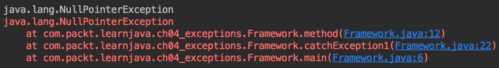

Exception Handling
==================

We have introduced exceptions briefly in [Chapter
1](https://subscription.packtpub.com/book/programming/9781789957051/1),
*Getting Started with Java 12*. In this chapter, we will treat this
topic more systematically. There are two kinds of exceptions in Java:
checked and unchecked exceptions. Both of them will be demonstrated and
the difference between the two will be explained. The reader will also
learn about the syntax of the Java constructs related to exceptions
handling and the best practices to address (handle) the exceptions. The
chapter will end with the related topic of an assertion statement that
can be used to debug the code in production.

The following topics will be covered in this chapter:

-   Java exceptions framework
-   Checked and unchecked (runtime) exceptions
-   The try, catch, and finally blocks
-   The throws statement
-   The throw statement
-   The assert statement
-   Best practices of exceptions handling


### Run Java Code
You can run the example by running following command in the terminal:
`java -cp target/learnjava-1.0.jar com.lv.learnjava.ch04_exceptions.CustomExceptions.java`

### Run Java Code
You can run the example by running following command in the terminal:
`java -cp target/learnjava-1.0.jar com.lv.learnjava.ch04_exceptions.Framework.java`

### Run Java Code
You can run the example by running following command in the terminal:
`java -cp target/learnjava-1.0.jar com.lv.learnjava.ch04_exceptions.Throws.java`

### Run Java Code
You can run the example by running following command in the terminal:
`java -cp target/learnjava-1.0.jar com.lv.learnjava.ch04_exceptions.TryCatchFinally.java`


Exception Handling
==================

As we have described in [Chapter
1](https://subscription.packtpub.com/book/programming/9781789957051/1),
*Getting Started with Java 12*, an unexpected condition can cause
the **Java Virtual Machine** (**JVM**) to create and throw an exception
object, or the application code can do it. As soon as it happens, the
control flow is transferred to the catch clause, if the exception was
thrown inside a try block. Let's see an example. Consider the
following method:

```
void method(String s){    if(s.equals("abc")){        System.out.println("Equals abc");    } else {        System.out.println("Not equal");    }}
```

If the input parameter value is null, one could expect to see the output
as Not equal. Unfortunately, that is not the case. The s.equals("abc")
expression calls the equals() method on an object referred by
the s variable, but, in case the s variable is null, it does not refer
to any object. Let's see what happens then.

Let's run the following code:

```
try {    method(null);} catch (Exception ex){    System.out.println(ex.getClass().getCanonicalName());                                //prints: java.lang.NullPointerException    ex.printStackTrace();     //prints: see the screenshot    if(ex instanceof NullPointerException){        //do something    } else {        //do something else    }}
```

The output of this code is as follows:



What you see in red on the screenshot is called a **stack trace**. The
name comes from the way the method calls are stored (as a stack) in JVM
memory: one method calls another, which in turns calls another, and so
on. After the most inner method returns, the stack is walked back, and
the returned method (**stack frame**) is removed from the stack. We will
talk more about JVM memory structure in [Chapter
9](https://subscription.packtpub.com/book/programming/9781789957051/9),
*JVM Structure and Garbage Collection*. When an exception happens, all
the stack content (stack frames) are returned as the stack trace. It
allows us to track down the line of code that caused the problem.

In our preceding code sample, different blocks of code were executed
depending on the type of the exception. In our case, it was
java.lang.NullPointerException. If the application code did not catch
it, this exception would propagate all the way through the stack of the
called methods into the JVM, which then stops executing the application.
To avoid this happening, the exception can be caught and some code is
executed to recover from the exceptional condition.

The purpose of the exception handling framework in Java is to protect
the application code from an unexpected condition and recover from it,
if possible. In the following sections, we will dissect it in more
detail and re-write the given example using the framework capability.


Exception Handling
==================

If you look up the documentation of the java.lang package API, you will
discover that the package contains almost three dozen exception classes
and a couple of dozen error classes. Both groups extend
the java.lang.Throwable class, inherit all the methods from it, and do
not add other methods. The most often used methods of
the java.lang.Throwable class are the following:

-   void printStackTrace(): Outputs the stack trace (stack frames) of
    the method calls
-   StackTraceElement[] getStackTrace(): Returns the same information as
    printStackTrace(),  but allows programmatic access of any frame of
    the stack trace
-   String getMessage(): Retrieves the message that often contains a
    user-friendly explanation of the reason for the exception or error
-   Throwable getCause(): Retrieves an optional object of
    java.lang.Throwable that was the original reason for the exception
    (but the author of the code decided to wrap it in another exception
    or error)

All errors extend the java.lang.Error class that, in turn,
extends the java.lang.Throwable class. An error is typically thrown by
JVM and, according to the official documentation, *indicates serious
problems that a reasonable application should not try to catch*. Here
are a few examples:

-   OutOfMemoryError: Thrown when JVM runs out memory and cannot clean
    it using garbage collection
-   StackOverflowError: Thrown when the memory allocated for the stack
    of the method calls is not enough to store another stack frame
-   NoClassDefFoundError: Thrown when JVM cannot find the definition of
    the class requested by the currently loaded class

The authors of the framework assumed that an application cannot recover
from these errors automatically, which proved to be a largely correct
assumption. That is why programmers typically do not catch errors and we
are not going to talk about them anymore.

The exceptions, on the other hand, are typically related to the
application-specific problems and often do not require us to shut down
the application and allow the recovery. That is why programmers
typically catch them and implement an alternative (to the main flow)
path of the application logic, or at least report the problem without
shutting down the application. Here are a few examples:

-   ArrayIndexOutOfBoundsException: Thrown when the code tries to access
    the element by the index that is equal to, or bigger than, the array
    length (remember that the first element of an array has index 0, so
    the index equals the array length points outside of the array)
-   ClassCastException: Thrown when the code casts a reference to a
    class or an interface not associated with the object referred to by
    the variable
-   NumberFormatException: Thrown when the code tries to convert a
    string to a numeric type, but the string does not contain the
    necessary number format

All exceptions extend the java.lang.Exception class that, in turn,
extends the java.lang.Throwable class. That is why by catching an object
of the java.lang.Exception class, the code catches an object of any
exception type. We have demonstrated it in the *Java exceptions
framework* section by catching java.lang.NullPointerException this way.

One of the exceptions is java.lang.RuntimeException. The exceptions that
extend it are called **runtime exceptions** or **unchecked exceptions**.
We have already mentioned some of them: NullPointerException,
ArrayIndexOutOfBoundsException, ClassCastException, and
NumberFormatException. Why they are called runtime exceptions is clear;
while why they are called unchecked exceptions will become clear in the
next paragraph.

Those that do not have java.lang.RuntimeException among their ancestors
are called **checked exceptions**. The reason for such a name is that a
compiler makes sure (checks) that these exceptions are either caught or
listed in the throws clause of the method (see *Throws
statement* section). This design forces the programmer to make a
conscious decision, either to catch the checked exception, or inform the
client of the method that this exception may be thrown by the method and
has to be processed (handled) by the client. Here are a few examples of
checked exceptions:

-   ClassNotFoundException: Thrown when an attempt to load a class using
    its string name with the forName() method of the Class class failed
-   CloneNotSupportedException: Thrown when the code tried to clone an
    object that does not implement the Cloneable interface
-   NoSuchMethodException: Thrown when there is no method called by the
    code

Not all exceptions reside in the java.lang package. Many other packages
contain exceptions related to the functionality that is supported by the
package. For example, there is a java.util.MissingResourceException
runtime exception and java.io.IOException checked exception.

Despite not being forced to, programmers often catch runtime (unchecked)
exceptions too, in order to have better control of the program flow,
making the behavior of an application more stable and predictable. By
the way, all errors are also runtime (unchecked) exceptions, but, as we
have said already, typically, it is not possible to handle them
programmatically, so there is no point in catching descendants of the
java.lang.Error class.


Exception Handling
==================

When an exception is thrown inside a try block, it redirects control
flow to the first catch clause. If there is no catch block that can
capture the exception (but then finally block has to be in place), the
exception propagates all the way up and out of the method. If there is
more than one catch clause, the compiler forces you to arrange them so
that the child exception is listed before the parent exception. Let's
look at the following example:

```
void someMethod(String s){    try {       method(s);    } catch (NullPointerException ex){       //do something    } catch (Exception ex){       //do something else    }}
```

In the preceding example, a catch block with NullPointerException is
placed before the block with Exception
because NullPointerException extends RuntimeException, which, in turn,
extends Exception. We could even implement this example as follows:

```
void someMethod(String s){    try {        method(s);    } catch (NullPointerException ex){        //do something    } catch (RuntimeException ex){        //do something else    } catch (Exception ex){        //do something different    }}
```

The first catch clause catches NullPointerException only. Other
exceptions that extend RuntimeException will be caught by the second
catch clause. The rest of the exception types (all checked exceptions)
will be caught by the last catch block. Note that errors will not be
caught by any of these catch clauses. To catch them, one should add
catch clause for Error (in any position) or Throwable (after the last
catch clause in the previous example), but programmers usually do not do
it and allow errors to propagate all the way into the JVM.

Having a catch block for each exception type allows us to provide an
exception type-specific processing. However, if there is no difference
in the exception processing, one can have just one catch block with
the Exception base class to catch all types of exceptions:

```
void someMethod(String s){    try {        method(s);    } catch (Exception ex){        //do something    }}
```

If none of the clauses catch the exception, it is thrown further up
until it is either handled by a try...catch statement in one of the
methods-callers or propagates all the way out of the application code.
In such a case, JVM terminates the application and exits.

Adding a finally block does not change the described behavior. If
present, it is always executed, whether an exception was generated or
not. A finally block is usually used to release the resources, to close
a database connection, a file, and similar. However, if the
resource implements the Closeable interface, it is better to use
the try-with-resources statement that allows releasing the
resources automatically. Here is how it can be done with Java 7:

```
try (Connection conn = DriverManager.getConnection("dburl",                                          "username", "password");     ResultSet rs = conn.createStatement()                        .executeQuery("select * from some_table")) {    while (rs.next()) {        //process the retrieved data    }} catch (SQLException ex) {    //Do something    //The exception was probably caused by incorrect SQL statement}
```

This example creates the database connection, retrieves data and
processes it, then closes (calls the close() method) the conn and
rs objects.

Java 9 enhanced try-with-resources statement capabilities by allowing
the creation of objects that represent resources outside the try block
and then the use of them in a try-with-resources statement, as follows:

```
void method(Connection conn, ResultSet rs) {    try (conn; rs) {        while (rs.next()) {            //process the retrieved data        }    } catch (SQLException ex) {        //Do something        //The exception was probably caused by incorrect SQL statement    }}
```

The preceding code looks much cleaner, although, in practice,
programmers prefer to create and release (close) resources in the same
context. If that is your preference too, consider using the throws
statement in conjunction with the try-with-resources statement.


Exception Handling
==================

The previous example of using a try-with-resources statement can be
re-written with resource objects created in the same context as follows:

```
Connection conn;ResultSet rs;try {    conn = DriverManager.getConnection("dburl", "username", "password");    rs = conn.createStatement().executeQuery("select * from some_table");} catch (SQLException e) {    e.printStackTrace();    return;}try (conn; rs) {    while (rs.next()) {        //process the retrieved data    }} catch (SQLException ex) {    //Do something    //The exception was probably caused by incorrect SQL statement}
```

We have to deal with SQLException because it is a checked exception,
and getConnection(), createStatement(), executeQuery(), and next()
methods declare it in their throws clause.  Here is an example:

```
Statement createStatement() throws SQLException;
```

It means that the method's author warns the method's users that it may
throw such an exception and forces them either to catch the exception or
to declare it in the throws clause of their methods. In our preceding
example, we have chosen to catch it and had to use two try...catch
statements. Alternatively, we can list the exception in the throws
clause too and, thus, remove the clutter by effectively pushing the
burden of the exception handling onto the users of our method:

```
void throwsDemo() throws SQLException {    Connection conn = DriverManager.getConnection("url","user","pass");    ResultSet rs = conn.createStatement().executeQuery("select * ...");    try (conn; rs) {        while (rs.next()) {            //process the retrieved data        }    } finally { }}
```

We got rid of the catch clause but Java syntax requires that either
a catch or finally block has to follow the try block, so we added an
empty finally block. 

The throws clause allows but does not require us to list unchecked
exceptions. Adding unchecked exceptions does not force the method's
users to handle them.

And, finally, if the method throws several different exceptions, it is
possible to list the base Exception exception class instead of listing
all of them. That will make the compiler happy, but is not considered a
good practice because it hides details of particular exceptions a
method's user may expect.

Please notice that the compiler does not check what kind of exception
the code in the method's body can throw. So, it is possible to list any
exception in the throws clause, which may lead to unnecessary overhead.
If, by mistake, a programmer includes a checked exception in the throws
clause that is never actually thrown by the method, the method's user
may write a catch block for it that is never executed. 


Exception Handling
==================

The throw statement allows throwing any exception that a programmer
deems necessary. One can even create their own exception. To create a
checked exception, extend the java.lang.Exception class:

```
class MyCheckedException extends Exception{    public MyCheckedException(String message){        super(message);    }    //add code you need to have here}
```

Also, to create an unchecked exception, extend
the java.lang.RunitmeException class, as follows:

```
class MyUncheckedException extends RuntimeException{    public MyUncheckedException(String message){        super(message);    }    //add code you need to have here}
```

Notice the comment *add code you need to have here*. You can add methods
and properties to the custom exception as to any other regular class,
but programmers rarely do it. The best practices even explicitly
recommend avoiding using exceptions for driving the business logic.
Exceptions should be what the name implies, covering only exceptional,
very rare situations.

But if you need to announce an exceptional condition use
the throw keyword and new operator to create and trigger propagation of
an exception object. Here are a few examples:

```
throw new Exception("Something happend"); throw new RunitmeException("Something happened");throw new MyCheckedException("Something happened");throw new MyUncheckedException("Something happened");
```

It is even possible to throw null as follows:

```
throw null;
```

The result of the preceding statement is the same as the result of this
one:

```
throw new NullPointerException;
```

In both cases, an object of an unchecked NullPointerException begins to
propagate through the system, until it is caught either by the
application or the JVM.


Exception Handling
==================

Once in a while, a programmer needs to know if a particular condition
happens in the code, even after the application has been already
deployed to production. At the same time, there is no need to run the
check all the time. That is where the branching assert statement comes
in handy. Here is an example:

```
public someMethod(String s){    //any code goes here    assert(assertSomething(x, y, z));    //any code goes here}boolean assertSomething(int x, String y, double z){ //do something and return boolean}
```

In the preceding code, the assert() method takes input from
the assertSomething() method. If the assertSomething() method returns
false, the program stops executing.

The assert() method is executed only when the JVM is run with
the -ea option. The -ea flag should not be used in production, except
maybe temporarily for testing purposes, because it creates the overhead
that affects the application performance.


Exception Handling
==================

The checked exceptions were designed to be used for the recoverable
conditions when an application can do something automatically to amend
or work around the problem. In practice, it doesn't happen very often.
Typically, when an exception is caught, the application logs the stack
trace and aborts the current action. Based on the logged
information, the application support team modifies the code to address
the unaccounted-for condition or to prevent it from occurring in the
future. 

Each application is different, so best practices depend on the
particular application requirements, design, and context. In general, it
seems that there is an agreement in the development community to avoid
using checked exceptions and to minimize their propagation in the
application code. And here are a few other recommendations that have
proved to be useful:

-   Always catch all checked exceptions close to the source
-   If in doubt, catch unchecked exceptions close to the source too
-   Handle the exception as close to the source as possible, because it
    is where the context is the most specific and where the root cause
    resides
-   Do not throw checked exceptions unless you have to, because you
    force building extra code for a case that may never happen
-   Convert third-party checked exceptions into unchecked ones by
    re-throwing them as RuntimeException with the corresponding message
    if you have to
-   Do not create custom exceptions unless you have to
-   Do not drive business logic by using the exception handling
    mechanism unless you have to
-   Customize generic RuntimeException by using the system of messages
    and, optionally, enum type, instead of using exception type for
    communicating the cause of the error


Exception Handling
==================

In this chapter, readers were introduced to the Java exception handling
framework, learned about two kinds of exceptions – checked and unchecked
(runtime) – and how to handle them using try-catch-finally and throws
statements. Readers have also learned how to generate (throw) exceptions
and how to create their own (custom) exceptions. The chapter concluded
with the best practices of exception handling.

In the next chapter, we will talk about strings and their processing in
detail, as well as input/output streams and file reading and writing
techniques.


